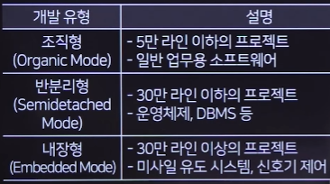
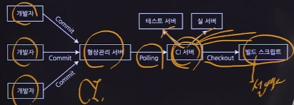
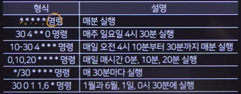
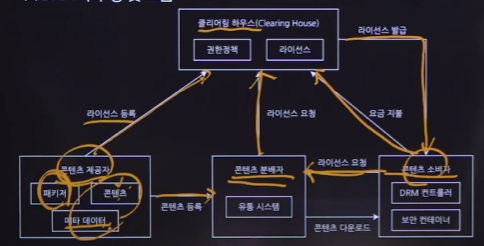
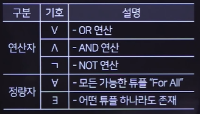
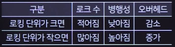
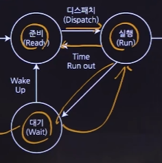
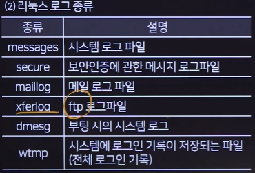

# 정보처리기사 실기 마무리 특강

## 1장 소프트웨어 구축

### 1-1 소프트웨어 공학 개념

#### 소프트웨어 공학

+ 효율적으로 품질 높은 소프트웨어를 개발하기 위한 학문
+ 역공학 : CASE 이용
+ 재공학 : 예방 유지보수의 생산성, 분석-재구성-역공학-이관
+ 재사용 : 합성 중심(블록), 생성 중심(추상화)

#### 개발 단계

+ 계획 - 분석 - 설계 - 구현 - 테스트 - 유지보수

#### 개발 방법론

+ 구조적 방법론 : 절차지향
+ 정보공학 방법론 : 기업
+ 객체지향 개발 방법론 : 캡상추다
+ CBD : 컴포넌트 베이스
+ 애자일 : XP, SCRUM, FDD, Crystal 방법론 등

#### 개발 모델

+ 폭포수 모델 : 순차적
+ 프로토타이핑 모델 : 시제품
+ 나선형 모델 : 계획-위험분석-개발-평가
+ RAD : CASE를 이용해 빠르게 빠르게
+ V모형 : 단위-통합-시스템-인수
+ 4세대 기법 : 명세서 > 코드를 생성

#### 애자일

+ 고객의 요구사항을 받아들여 빠르게 개발

+ XP : 의사결정, 피드백, 존중, 용기, 단순성
+ 스크럼 : 30일 정도의 주기마다 결과를 제공, 매일 15분 회의, 스프린트
+ 크리스털, FDD, ASD, Lean(도요타)

#### IT 서비스 관리

+ SLM(Service Level Management) : IT 서비스의 품질을 높이는 일련의 관리 및 활동
+ SLA(Service Level Agreement) : 문서
+ ITSM : 정책과 관행
+ ITIL : ITSM을 실현하기 위한 도구

### 1-2 프로젝트 계획 및 분석

#### 프로젝트 관리

+ 3P : 사람, 문제, 프로세스
+ PMBOK : 착수-계획-실행-통제-종료

#### 개발 비용 산정

+ 하향식 : 전문가, 델파이

+ 상향식 : LOC, M/M

+ 수학식

  + COCOMO

  

  + PUTNAM : Rayleigh-Norden, SLIM
  + FP : ESTIMACS, 외부입력, 외부출력, 외부조회, 내부논리파일, 외부연계파일

#### 개발 일정 산정

+ 순서 : WBS-PERT/CPM-임계경로-간트차트
+ WBS : 활동과 업무를 세분화
+ PERT/CPM : 전체 작업의 완료시간을 결정하고 단축함

#### 현행 시스템 분석

+ 플랫폼 : 연결기능, 비용감소, 브랜드 신뢰 기능, 커뮤니티 형성
+ CPND (Contents Platform Network Device) : 사용자의 단말기로 서비스가 이루어짐
+ 미들웨어 : RPC(API 호출), MOM(비동기), ORB(객체요청브로커), DB접속, TP모니터(트랜잭션), WAS(동적), ESB

#### 요구 공학

+ 도출-분석-명세-확인
+ 상위 CASE 도구(분석설계), 하위 CASE 도구(구현테스트), 통합 CASE 도구(형상관리)
+ 기능적 요구사항, 비기능적 요구사항(보안, 성능, 품질, 안정성)
+ HIPO : 모듈로 구분해 인터페이스를 계층화, 하향식 소프트웨어 개발을 위한 문서화 도구(구조적)
  + 가시적 도표 : 전체 기능, 사이트맵
  + 총체적 도표 : 입출력처리에 대한 전반적 정보 제공
  + 세부적 도표 : 더 복잡

#### 요구사항 분석 모델링

+ 모델링 구분 : 기능적, 정적(클래스 다이어그램), 동적(순서, 상태, 커뮤니케이션 다이어그램)
+ 구조적 분석 도구
  + 자료 흐름도(DFD) : 처리 과정(동그라미), 저장소(=), 단말(네모)
  + 자료사전(DD) : 자료흐름도에 기술된 자료를 자세히 정의, 회원 = 이름 + 나이 + (몸무게) + [남|여]
  + 소단위 명세서 : 자료흐름도에서 어떤 일이 수행되는지 상세히 작성
  + ERD : 개체-속성-관계
  + 상태 전이도(STD)
+ 객체 지향 분석 방법론
  + 럼바우 : 객-동-기, 정적인 구조가 어떤 동작을 가지고 어떤 기능을 표현할 것인지, 객체-상태-DFD
  + Booch : 미시적, 거시적
  + Jacobson : use case
  + Coad와 Yourdon : ERD
  + Wrifs-Brock : 분석과 설계 간 구분 없음

### 1-3 소프트웨어 설계

#### 설계 원리

+ 분할과 정복 : 여러 개의 작은 서브시스템
+ 추상화 : 공통의 성질을 모델링, 과정-데이터-제어 추상화
+ 단계적 분해 : 점점 작은 단위로
+ 모듈화
+ 정보은닉

#### 설계 모델링

+ 협약에 의한 설계 : 선행 조건, 결과 조건, 불변 조건

#### 소프트웨어 아키텍처

+ 4+1뷰
  + 논리적 관점 : 요구사항 분석, 설계

  + 구현 관점 : 개발자의 관점

  + 배치 관점 : 시스템 엔지니어의 관점

  + 프로세스 관점 : 효율성, 성능

  + 사용자 관점 : use case
+ 패턴 종류
  + 계층화 패턴 : 구조화
  + 클라이언트-서버 패턴 : 서로 생각하면서 보내고 받음
  + 마스터-슬레이브 패턴 : 단순 입력, 출력
  + 파이프-필터 패턴 : 데이터 스트림
  + 브로커 패턴 : 분리된 컴포넌트, 분산 시스템
  + 피어 투 피어 : 파일 공유
  + 이벤트-버스 패턴 : 이벤트 버스를 통해 특정 채널로 메시지를 발행, 단체 카톡
  + MVC
  + 블랙보드 패턴 : 해결 전략이 알려지지 않은 문제
  + 인터프리터 패턴 : 특정 언어로 작성된 프로그램을 해석하는 컴포넌트 설계

#### UML

+ 특징 : 가시화 언어, 명세화 언어, 구축 언어, 문서화 언어

#### UML 구성요소

+ 사물 : 구조사물, 행동사물, 그룹사물, 주해사물
+ 관계
  + 일반화 관계 : 상속, 실선빈삼각형
  + 연관 관계 : 2개 이상 관계, 실선삼각형
  + 의존 관계 : 짧은 시간, 점선삼각형
  + 실체화 관계 : 오버라이딩, 점선빈삼각형
  + 집합 관계 - 집약 관계 : has a 관계, 전체 객체가 사라져도 부분 객체는 사라지지 않음, Aggregation
  + 집합 관계 - 합성 관계 :  의존적, 전체 객체가 없어지면 부분 객체도 없어짐, Composition
+ 다이어그램
  + 구조 다이어그램
    + 클래스 : 클래스의 속성과 클래스 사이의 관계를 표현
    + 객체 : 클래스에 속한 인스턴스를 특정 시점의 객체와 객체 사이 관계로 표현
    + 컴포넌트 : 컴포넌트 사이 관계나 인터페이스를 표현
    + 배치 : 노드와 통신 경로를 표현, 물리적 요소
    + 복합체 :  클래스나 컴포넌트가 복합구조를 가질 때
    + 패키지 다이어그램 : 유스케이스나 클래스 등 모델 요소들을 그룹화한 패키지들의 관계 표현
  + 행위 다이어그램
    + 유스케이스 : 요구사항 분석
    + 시퀀스 : 특정 행동이 어떤 순서로 상호작용하는지
    + 커뮤니케이션 : 동작에 참여한 객체들이 주고받는 메시지
    + 상호작용 : 제어 흐름 표현
    + 타이밍 : 상태 변화와 시간 제약 명시

#### 주요 다이어그램

+ 클래스 다이어그램 : 속성과 행동으로 구성
+ 유스케이스 다이어그램
  + 시스템
  + 액터
  + 유스케이스 : 시스템의 기능
  + 관계 : 연관관계(실선), 포함관계(반드시실행>로그인), 확장관계(첨부파일), 일반화관계(상속)

### 1-4 화면 설계

#### UI 설계

+ 유형 : CLI, GUI, NUI(움직임), OUI(현실의 모든것), AUI(음성)
+ 요구사항 구분 : 기능적, 비기능적
+ 설계 원칙 : 직관성, 유효성, 학습성, 유연성 (중요) 유유직학?
+ 설계 도구 : 와이어프레임(선), 스토리보드(모두 참여), 프로토타입, 목업(와이어프레임보다 좀 더 실제처럼), 유스케이스

#### 감성 공학

+ 심리학 + 인간공학 + 생산공학
+ 감각적 감성, 기능적 감성, 문화적 감성

#### 화면 레이아웃 구성

+ HTML, CSS, Javascript
+ 웹 표준, 웹 호환성, 웹 접근성, 인포그래픽, 내비게이션, 아코디언, 플레이스홀더, 반응형 웹, BI

### 1-5 서버 프로그램 구현

#### 서버 환경 구축

+ 웹 서버 : 아파치, Nginx, IIS, GWS
+ WAS : 톰캣, weblogic, webspere, Jeus(공기업)
+ DBMS : 오라클, MySQL, MS-SQL
+ 파일서버 : 파일 저장 및 공유, was를 여러대 운용할 경우 마운트
+ 로드 밸런서 : 랜덤, Least loaded, Round Robin
+ CDN(Content Delivery Network) : 사용자와 가까운 곳에 분산되어 있는 데이터 저장 서버

#### 개발 소프트웨어 환경

+ 시스템 소프트웨어 : 운영체제, JVM, 웹서버, WAS, DBMS
+ 개발 소프트웨어 : 요구사항 관리 도구, 설계/모델링 도구, 구현 도구, 테스트 도구, 형상관리 도구
+ IDE(통합 개발 도구) : 이클립스, 비주얼 스튜디오, Xcode, 인텔리제이
+ 협업 도구

#### 형상 관리 도구

+ 소프트웨어의 변경사항을 체계적으로 관리하는 것, 변경-버전-형상
+ 형상 관리 절차 : 식별 - 통제 - 감사 - 기록 (중요!!!) 식통감기
  + 식별 : 버전 관리
  + 통제 : 소프트웨어 형상 변경 요청을 검토하고 승인해 현재의 베이스라인에 반영될 수 있도록 통제, CCB
  + 감사
  + 기록 

#### 버전 관리 도구

+ 공유 폴더 방식 : RCS, SCCS
+ 클라이언트/서버 방식
  + CVS : 롤백 안됨, 느림
  + SVN : 원본과의 차이점 저장, Trunk(메인 줄기), Branches(가지 치기), Tags
+ 분산 저장소 방식
  + Git : 로컬과 원격 저장소
+ 기타 관리 도구
  + Clear case : IBM
  + BitKeeper : SVN과 비슷
  + RCS : 수정을 한 사람만으로 제한
+ 사용 방식 : import > check out > add, commit > update

#### 빌드 도구

+ 빌드, 테스트, 배포를 자동으로 수행

+ 도구 종류
  + Make : 유닉스
  + Ant : 자바 기반
  + Maven : 의존성을 리스트 형태로 관리, pom.xml
  + Jenkins : CI, 배포 가능
  + Gradle : 그루비 기반, 안드로이드 앱 개발 환경 > 확장 가능

#### 개발 프레임워크

+ 라이브러리 : 빈번하게 사용되는 루틴 또는 리소스를 모아둔 것, 언어에 종속
+ 프레임워크 : 뼈대 제공
  + 모듈화, 재사용성, 확장성, 제어의 역전
  + 전자정부, 스트럿츠, 스프링, ORM
+ API : 다른 종류의 소프트웨어에 서비스를 제공할 수 있는 소프트웨어 인터페이스

#### 모듈 구현

+ FAN-OUT 최소화, FAN-IN 증가 : 개수를 구해야합니다!!!
+ 원칙 : 정명완일추~

#### 결합도

+ 두 모듈 사이의 연관 관계
+ 자료 : 값만 전달
+ 스탬프 : 배열이나 오브젝트 > 주소가 전달
+ 제어 : 제어 요소가 전달 > if문 내에서 사용될 경우
+ 외부(External) : 외부의 다른 모듈
+ 공통 : 전역 변수를 참조하고 갱신
+ 내용 : 스파게티

#### 응집도

+ 모듈 내부 구성 요소간 연관 정도
+ 기능적(Functional) : 단일 목적
+ 순차적(Sequential) : 하나의 출력값이 다른 활동이 사용할 경우
+ 통신적(Communication) : 동일한 입력과 출력
+ 절차적(Procedural) : 모듈 내부의 기능을 순차적으로 수행
+ 시간적(Temporal) : 특정 시간대
+ 논리적(Logical) : 유사한 성격
+ 우연적(Coincidental) : 연관이 없음

#### 공통 모듈 구현

+ DTO/VO, SQL, DAO, Service, Controller, Annotation
+ MVC 모델
  + 프레젠테이션 계층 : 뷰
  + 제어 계층 : 컨트롤러
  + 비즈니스 로직 계층 : 핵심 업무 로직
  + 퍼시스턴스 계층 : DAO, 데이터베이스 CRUD
  + 도메인 모델 계층 : DTO

#### DBMS 접속기술

+ 소켓통신
+ vender API : 벤더사마다 다 달라서 실질적 이용불가
+ JDBC : 자바에서 사용되는 표준 API
+ ODBC : 표준 규격

#### ORM

+ Object Relational Mapping : 객체와 DB의 데이터를 자동으로 매핑해주는 것
+ SQL Mapper : 단순 필드를 매핑, mybatis, ibatis
+ OR Mapping : 쿼리문 안 만들어도 됨, JPA, hibernate

#### 시큐어 코딩

+ OWASP : 오픈소스 웹 애플리케이션 보안 프로젝트, OWASP Top 10, 시큐어 코딩 가이드
+ 입력 데이터 검증 및 표현, 보안 기능, 시간 및 상태, 에러 처리, 코드 오류, 캡슐화, API 오용
+ 뒤에 정보보안에서 더 자세히 나옴!!!

#### 배치 프로그램

+ 일괄적으로 모아서 처리
+ 필수 요소 : 대용량 데이터, 자동화, 견고함, 안정성, 성능 대자견안성~
+ 크론탭(crontab) : Unix, Linux 계열에서 사용 (분 시 일 월 요일 명령어) 

### 1-6 인터페이스 구현

#### 인터페이스 시스템

+ 송수신 전문 구성 : 전문 공통부, 전문 개별부, 전문 종료부

#### 내/외부 모듈 연계 방식

+ 구축유형
  + point to point : 미들웨어 없이 연결
  + hub & spoke : 허브시스템을 통해 전송하는 중앙 집중형
  + 메세지 버스 : 미들웨어 있음
  + 하이브리드 : 허브 + 버스
+ 기업에서 운영되는 서로 다른 애플리케이션들 간의 정보 전달, 연계, 통합을 가능하게 해주는 솔루션
+ EAI의 예시 : 한 기업의 CRM, ERP, SCM이 각각 다른 업체에서 제작한 것이라고 할 때, 서로 다른 시스템 사이에 통신을 가능하게 하는 허브의 역할을 하며, 다른 시스템과 통신할 때는 모두 중앙 허브를 거쳐야 함
  + 일반적으로 간단한 통합 시나리오에 적합
  + Enterprise Application Integration
+ ESB의 예시 : 위와 동일할 때, 직접 통신하는 대신, ESB는 고유의 프로토콜을 사용해 메시지를 필요한 시스템에 버스를 통해 전달, 서로 다른 시스템에 대해 알 필요 없이 ESB와만 통신하면 됨
  + 일반적으로 복잡한 통합 시나리오에 적합
  + Enterprise Service Bus

#### 인터페이스 연계 기술

+ Link : DB 링크 객체
+ DB connection : WAS에서 DB 연결하는 커넥션 풀을 생성
+ JDBC
+ API/OpenAPI
+ Web service : WSDL(xml 설명서), UDDI(WSDL 모아놓는 공간), SOAP(실제 프로토콜)
+ 하이퍼링크
+ 소켓 : 클라이언트와 직접 연결

#### 인터페이스 전송 데이터

+ JSON : 키-밸류
+ XML : 마크업 언어
+ YAML : 직렬화 언어
+ CSV : 쉼표(,)로 구분

#### 인터페이스 구현

+ AJAX : 비동기 방식으로 데이터를 교환할 수 있는 통신 기능
+ SOAP(Simple Object Access Protocol) : 도서관에서 설명서를 받아서 실제 통신하는 프로토콜
  + WSDL : Web Services Description Language, 설명서, 웹 서비스의 구체적 내용이 기술되어 있어 서비스 제공 장소, 서비스 메시지 포맷, 프로토콜 등이 기술되어 있는 언어
  + UDDI : Universal Description Discovery and Integration, 도서관
  + SAML(인증/권한관리), XKMS(키관리), XACML(접근제어)
  + RESTful 보다 상대적으로 개발이 어려움
  + SOA : 서비스 지향 아키텍쳐
+ REST : URI를 통해 자원 명시, method를 통해 CRUD
  + 자원, 행위, 표현
  + 유니폼 인터페이스(어떤 언어, 플랫폼), stateless(한번 연결), cacheable, 자체 표현 구조(쉽게 이해)
  + 표준이 없음, 관계형 DB와 맞지 않음
  + ROA : 자원 지향 아키텍쳐

#### 인터페이스 보안

+ 네트워크 영역 : IPSec, SSL, S-HTTP
+ 애플리케이션 영역 : 시큐어 코딩
+ DB 영역

#### 인터페이스 검증

+ xUnit : 다양한 언어의 단위 테스트
+ STAF : 서비스 호출 및 컴포넌트 재사용
+ Fitnesse : 웹 기반
+ NTAF : fit + staf 네이버
+ selenium : 웹 애플리케이션 테스트
+ watir : 루비
+ 구현 감시 도구 : APM, 스카우터, 제니퍼 등

### 1-7 객체지향 설계

#### 객체지향

+ 구성요소

  + 클래스 : 설계도, 데이터 추상화 단위

  + 객체(인스턴스) : 클래스로부터 만들어진 객체, 실제 메모리에 올라감

  + 속성 : 필드

  + 메소드 : 명령문의 집합

  + 메시지 : 객체의 메소드 호출

+ 캡슐화 : 데이터와 메소드를 하나로 묶은 것
+ 정보은닉 : 다른 객체에게 숨김
+ 상속
+ 다형성 : 오버로딩, 오버라이딩
+ 추상화

#### 객체지향 설계원칙(SOLID)

+ 단일 책임 원칙 : 하나의 클래스는 하나의 책임
+ 개방 폐쇄 원칙 : 확장에는 열려있고 수정에는 폐쇄
+ 리스코프 치환 원칙 : 상속받은 클래스는 언제나 대체 가능
+ 인터페이스 분리 원칙 : 사용하지 않는 인터페이스는 구현 X
+ 의존성 역전 원칙 : 자주 변하지 않는 추상 클래스나 인터페이스에 의존해야 함

#### 디자인 패턴

+ GoF의 디자인 패턴 분류 : 생성, 구조, 행위
+ 생성 패턴
  + 추상 팩토리 : 구체적인 클래스에 의존하지 X
  + 빌더 : 복합 객체의 생성과 표현을 분리
  + 팩토리 메소드 : 객체 생성을 서브클래스로 위임
  + 프로토타입 : 원본 객체를 복사함으로써 객체를 생성
  + 싱글톤 : 객체는 오직 하나
+ 구조 패턴
  + 어댑터 : 다른 인터페이스로 변환
  + 브릿지 : 구현부에서 추상층을 분리 > 추상화 하는거..
  + 컴포지트 : 트리 구조
  + 데코레이터 : 덧붙이는 방식
  + 퍼사드 : Wrapper 클래스 제공
  + 플라이웨이트 : 작은 객체를 공유해 메모리를 절약
  + 프록시 : 객체의 대리 제공
+ 행위 패턴
  + 책임 연쇄 : 연쇄적으로 묶어 요청을 전달
  + 커맨드 : 객체의 요청 캡슐화
  + 인터프리터 : 언어의 문법
  + 반복자 : 순차적으로 접근할 수 있는 동일한 인터페이스 제공
  + 중재자 : 객체의 상호작용 캡슐화
  + 메멘토 : 되돌아옴
  + 옵저버 : 자동 갱신
  + 상태 : 상태에 따라 같은 동작을 다르게 처리해야 할 때
  + 전략 : 알고리즘
  + 템플릿 메소드 : 부모-자식
  + 방문자

### 1-8 애플리케이션 테스트

#### 소프트웨어 테스트

+ 필요성 : 오류 발견 관점, 오류 예방 관점, 품질 향상 관점
+ 기본 원칙 : 결함 집중, 파레토 법칙, 살충제 패러독스(테스트 케이스를 변경해라), 오류-부재의 궤변

#### 테스트 오라클

+ 테스트의 결과가 참인지 거짓인지를 판단하기 위해 사전에 정의된 참 값을 입력해 비교하는 기법
+ 참 오라클 : 모든 테스트 케이스 입력값, 크리티컬한 업무
+ 샘플링 오라클 : 일반 업무
+ 휴리스틱 오라클 : 나머지는 추정으로 처리
+ 일관성 검사 오라클 : 변경이 있을 때 확인

#### 테스트 레벨

+ 단위 테스트 : JUnit
+ 통합 테스트
+ 시스템 테스트
+ 인수 테스트

#### 소프트웨어 테스트 기법

+ 정적 테스트 : 소스코드 내부의 논리적 구조
+ 동적 테스트 : 실행 후 발견
+ 테스트 기법 : 정적/동적 의미 없음
  + 화이트박스 : 내부 구조와 동작을 검사
    + 기초 경로 검사 : McCabe > 구역 + 1
  + 블랙박스 : 구현된 기능을 테스트
    + 동등 분할 기법(Equivalence Partitioning) : 입력 자료에 초점을 맞춰 분석
    + 경계값 분석(Boundary Value) : 중간값보다 경계값에서 오류가 발생할 확률이 높다~
    + 원인-효과 그래프 검사(Cause-Effect Graphing) : 입력 데이터 간의 관계와 출력
    + 오류 예측 검사(Error Guessing) : 과거의 경험 
    + 비교 검사(Comparison) : 여러 버전의 프로그램에 테스트
+ 테스트 시각
  + 검증(Verification) : 개발자
  + 확인(Validation) : 사용자
+ 테스트 목적
  + 회복, 안전, 강도(과부하), 성능, 구조, 회귀(수정된 코드), 병행, A/B 테스트, 스모크 테스트(테스트 환경을 테스트)
+ 테스트 종류
  + 명세 기반 테스트 : 명세서를 보면서 비교
  + 구조 기반 테스트 : 내부 구조
  + 경험 기반 테스트 : 테스터의 직관과 기술 능력을 기반 > QA

#### 테스트 커버리지

+ 테스트를 얼마나 수행했는지 측정하는 기준
+ 기능 기반 커버리지 : UI 설계에서 나오는 화면을 모수로 사용, 100% 달성
+ 라인 커버리지 : 전체 소스코드의 라인 수
+ 코드 커버리지 : 소스코드의 구문, 조건 구조
  + 구문 커버리지 : 모든 구문에 대해 수행
  + 조건 커버리지 : 결정포인트 내의 개별 조건식에 대해 수행
  + 결정 커버리지 : 결정포인트 내의 모든 분기분에 대해 수행
  + 조건/결정 커버리지 : 결정포인트 T/F, 개별조건식 T/F
  + 변경 조건/결정 커버리지 : 모든 결정포인트 내의 개별조건식은 적어도 한번 T/F, 이론적으로 가장 안전한 조합
  + 다중 조건 커버리지 : 100% 보장

#### 결함 관리 도구

+ 에러 발견 > 에러 등록 > 에러 분석 > 결함 확정 > 결함 할당 > 결함 조치 > 결함 검토 및 승인
+ 결함 관리 측정 지표 : 결함 분포, 결함 추세, 결함 에이징

#### 테스트 자동화 도구

+ 테스트 작업을 스크립트 형태로 구현해 테스트를 반복 수행 > 스크립트 만드는게 힘들다
+ 정적 분석 도구, 테스트 실행 도구, 성능 테스트 도구, 테스트 통제 도구
+ 테스트 장치(Test Harness)
  + Test Driver : 상향식 테스트
  + Test Stub : 하향식 테스트
  + Test Suites : 테스트 케이스의 집합
  + Test Case : 입력 값, 실행 조건, 기대 결과 등의 집합 (중요)
  + Test Script : 실행 절차
  + Mock Object : 생각하는 임시 모듈

#### 통합 테스트

+ 점증적 방식
  + 상향식 : 하위 모듈을 클러스터로 결합, 드라이버
  + 하향식 : 더미 모듈(스텁)
+ 비 점증적 방식
  + 빅뱅 : 한꺼번에 통합, 소규모 시스템
+ 백본 테스트 : 샌드위치 테스트, 상향식+하향식

#### 애플리케이션 성능 개선

+ 저하 원인
  + 데이터베이스 락 : 대량 조회, 대량 업데이트
  + 불필요한 패치
  + 연결 누수 : 커넥션 풀 사용 후 반환하지 않을 때
+ 성능 분석 지표
  + 처리량
  + 응답 시간 : 빵 좀 사와 > 네!
  + 경과,반환 시간 : 빵 좀 사와 > 네 > 사옴
  + 자원 사용률
+ 성능 분석 도구 : JMeter(다양한 프로토콜 지원), LoadUI, OpenSTA(HTTP, HTTPS)
+ 모니터링 도구 : Scouter, NMon(리눅스), Zabbix(웹기반), Jeniffer(애플리케이션)

#### 정형 기술 검토회의

+ FTR : Formal Technical Review
+ 제품의 검토, 메모 공유, 반박 제한, 참가자 제한, 사전 준비, 사전 교육

#### 소스코드 품질 분석

+ 동료 검토 : 2-3명
+ 워크스루 : 팀 회의
+ 인스펙션 : 공식 검토 회의
  + 계획 > 사전교육 > 준비 > 회의 > 수정 > 후속조치

#### 소스코드 품질 분석 도구

+ 정적 분석 도구 : PMD(자바), checkstyle, SonarQube, cppcheck, ccm, cobertura
+ 동적 분석 도구 : Avalanche, Valgrind

#### 성능 개선

+ 리팩토링을 통해 코드 스멜을 제거
+ 리팩토링 : 기능을 바꾸지 않으면서 내부 구조를 개선하는 작업
+ 코드 스멜 : 심각한 문제를 일으킬 가능성이 있는 소스코드
  + 스파게티 코드
  + 외계인 코드
  + 클린 코드 : 가독성, 단순성, 의존성 배제, 중복 최소, 추상화

### 1-9 소프트웨어 유지보수와 패키징

#### 유지보수의 구분

+ 수정 보수(Corrective) : 테스트에서 발견하지 못한 잠재적인 오류
+ 적응 보수(Adaptive) : 환경변화
+ 향상 보수(Perfective) : 추가 기능, 가장 많은 비용 발생
+ 예방 보수(Preventive) : 재공학 

#### 제품 품질 국제 표준

+ ISO/IEC 9126 : 제품의 품질
  + 기능성
  + 신뢰성 : 유지
  + 사용성
  + 효율성 : 자원
  + 유지보수성
  + 이식성
+ ISO/IEC 14598 : 평가 프로세스에 대한 표준
  + 반복성 : 동일 평가자 동일 사양 동일한 결과
  + 재현성 : 다른 평가자 동일 사양 비슷한 결과
  + 공정성
  + 객관성
+ ISO/IEC 12119 : 테스트
+ ISO/IEC 25000 : 통합

#### 프로세스 품질 국제 표준

+ 소프트웨어 업체의 프로세스 관리 능력을 평가
+ ISO/IEC 12207
  + 기본 생명주기 프로세스 : 진짜 기본적인 것들
  + 지원 생명주기 프로세스 : 문서화, 형상관리, 품질보증
  + 조직 생명주기 프로세스 : 관리, 개선, 교육훈련
+ ISO/IEC 15504(SPICE)
  + 불안정 > 수행 > 관리 > 확립(표준 프로세스) > 예측(정량적 관리) > 최적화
+ CMM(Capability Maturity Model)
  + 초기 > 반복 > 정의 > 관리 > 최적화 반정관
+ CMMI(Integration)
  + 초기 > 관리 > 정의 > 정량적 관리 > 최적화 관정정

#### 서비스 관리 국제 표준

+ ISO/IEC 20000

#### 애플리케이션 패키징/배포

+ 릴리즈 노트 : 제품과 함께 배포되는 문서

+ CI(Continuous Integration) : 지속적인 통합
+ CD(Continuous Delivery & Deployment) : 지속적인 배포

#### DRM

+ 디지털 콘텐츠의 사용 권리를 제어

+ 콘텐츠 제공자 : 콘텐츠 + 메타 데이터 = 패키저
+ 클리어링 하우스 : 라이선스, 권한정책
+ 콘텐츠 분배자 : 유통 시스템
+ 콘텐츠 소비자 : DRM 컨트롤러, 보안 컨테이너

+ 제어 기술
  + 콘텐츠 식별 체계 : DOI, URI
  + 메타데이터 : 콘텐츠의 콘텐츠
  + 권리 표현 기술 : XrML
    + Render : 이용
    + Transport : 교환
    + Derivative : 추출, 변형

+ 워터마킹
  + 워터마킹 : 불법 복제 방지, 저작권 정보, 최조 저작 시점
  + 핑거프린팅 : 불법 유통 방지, 저작권 정보 + 구매자 정보, 구매시점마다

## 2장 데이터베이스 구축

### 2-1 데이터베이스 개념

#### 기본 개념

+ 공유 데이터, 저장 데이터, 통합 데이터, 운영 데이터
+ 데이터 언어
  + DDL 정의
  + DML 조작
  + DCL 제어
+ 스키마 : 데이터베이스의 구조와 제약조건에 관해 전반적인 명세를 기술한 것, 데이터 사전에 저장
  + 외부 : 사용자 뷰
  + 개념 : 전체적인 뷰
  + 내부 : 믈리적 저장장치의 입장

#### DBMS

+ 종류(목표 DBMS)
  + 계층형 : 트리
  + 네트워크형 : 다대다, CODASYL
  + 관계형 : 키-밸류 데이터를 테이블 구조로
  + 객체지향형 : 비정형
  + 객체관계형 : 관계형 + 객체지향형
  + NoSQL : Not Only SQL, 비정형 데이터 지원
  + NewSQL : 관계형 + NoSQL
+ 설계 단계
  + 개념적 설계 : ERD
  + 논리적 설계 : 목표 DBMS, 정규화, T/I
  + 물리적 설계 : 특정 DBMS, 성능과 용량을 위해 반정규화, 하기 전에 파티션, 인덱스 등 처리

#### 데이터모델 개념

+ 구조, 연산, 제약 조건
+ ERD
  + 개체 : 네모
  + 속성 : 타원
    + 단일 값
    + 다중 값
    + 단순 : 의미를 더는 분해할 수 없는 속성(성별)
    + 복합 : 의미를 분해할 수 있는 속성(주소), 이중 타원
    + 유도 : 주민번호, 성별
    + 기본키 : 밑줄 타원
  + 관계 : 마름모
+ 품질 기준 : 정완이가 준 제일 활발해~

#### 논리 데이터베이스 설계 과정 - 정규화

+ 이상현상 : 중복을 최소화
  + 삽입 : 데이터를 삽입할 때 불필요한 데이터도 함께 삽입됨
  + 삭제 : 하나의 튜플을 삭제할 때 연쇄 삭제로 인해 정보 손실
  + 갱신 : 튜플을 갱신할 때 일부 튜플만 갱신되어 정보에 모순이 생김
+ 함수적 종속
  + 완전 함수적 종속 : 주민번호 -> 이름 / 회원번호+주문번호 -> 강의명
  + 부분 함수적 종속 : 복합 기본키일 때, 모두 다 만족하지 않고 일부에만 종속될 때
  + 이행적 함수 종속(Transitive) : X->Y, Y->Z, X->Z, 필요없는 필드는 넣지 말자~

#### 정규화 과정

+ 1정규화 : 도메인이 원자값
  + 고객번호 - 이름 - 여행지 : 하나의 고객이 여러 여행지를 가질 수 있을 때 원자값 분리
+ 2정규화 : 부분 함수적 종속 제거
  + 복합키 중 일부만 종속될 때 이것을 제거하고 복합키 모두에 종속되게 만들어야 함
  + 학생아이디 - 강의아이디 - 강의이름 : 강의이름은 강의아이디에만 종속된다~
+ 3정규화 : 이행적 함수 종속 제거
  + 기본키에 직접 종속된 속성만을 포함하는 것이 목적
  + 주문번호 - 고객아이디 - 고객명 : 고객명까지는 필요없다~
+ BCNF : 결정자이면서 후보키가 아닌 것 제거
+ 4정규화 : 다치 종속 제거
+ 5정규화 : 조인 종속성 이용

#### 물리 데이터베이스 설계 과정

+ 반정규화 : 시스템의 성능 항샹을 위해 정규화에 위배되는 중복을 허용하는 기법
+ 데이터베이스 이중화 : 고가용성을 위해 
  + Eager : 변경 즉시 / Lazy : 트랜잭션 단위
  + Active-Standby : Hot standby(즉시 사용 가능)

#### 데이터베이스 백업

+ 백업 방식

  + 풀 백업 : 모든 데이터

  + 증분 백업 : 풀 백업 이후 변경/추가된 데이터만

  + 차등 백업 : 풀 백업 이후 변경/추가된 데이터를 모두 포함해 백업, 항상 2개

  + 실시간 백업

  + 트랜잭션 로그 백업 : 모든 SQL문을 기록

  + 합성 백업 : 전체 + 여러 개의 증분

+ 복구 시간 목표/복구 시점 목표

  + RTO : 중단 시점과 복원 시점 간에 허용되는 최대 지연 시간, 2시간 안에 살려라!
  + RPO : 마지막 복구 시점과 중단 시점 사이에 허용되는 데이터 손실량

#### 데이터베이스 암호화

+ API 방식 : 프로그램단에서
+ 플러그인 : 제품 설치
+ TDE(Transparent Data Encryption) : DBMS가 자체 제공하는 것

#### 파티셔닝

+ 샤딩 : 하나의 거대한 데이터베이스를 여러 개의 작은 조각으로 나누어 분산 저장해 관리
+ 종류
  + 수평 분할(Ho) : 스키마를 복제한 후 샤드키를 기준으로 데이터를 나눔, 구조가 같음
  + 수직 분할(Ver) : 자주 사용하는 컬럼 등을 분리
+ 분할 기준
  + 범위 분할 : 월별, 분기별 > range
  + 목록 분할 : 특정 그룹 > list
  + 해시 분할 : 병렬 처리
  + 라운드 로빈 분할 : 균일하게 분배
  + 합성 분할 : 복합적으로 사용

#### 클러스터/인덱스

+ 클러스터 : 자주 사용하는 데이터를 디스크의 같은 위치에 저장
+ 인덱스 : 검색 속도를 향상시키기 위한 자료구조
  + 클러스터 인덱스 : 테이블 당 1개만 허용, 테이블이 물리적으로 정렬
  + 넌클러스터 인덱스 : 240개의 인덱스 테이블
  + 밀집 인덱스, 희소 인덱스

#### 뷰

+ 뷰 : 가상 테이블
+ 단점 : 삽입, 삭제, 갱신 불가 > 논리적, 가상으로만 존재하기 때문

#### 시스템 카탈로그

+ 데이터베이스가 자동으로 만들어주는 데이터 사전
+ 접근 가능하지만 수정 불가

### 2-2 관계 데이터베이스 모델

#### 관계 데이터 모델

+ 속성의 수 = degree = 차수 / 튜플의 수 = 레코드 = cardinality

#### 관계대수/관계해석

+ 관계대수 : 절차적 언어
  + 순수 관계 연산자
    + SELECT : 시그마, AND(^), OR(v) >>> 시그마 성적 > 90 (학생) : 학생 테이블에서 성적이 90 초과
    + PROJECT : 파이<리스트>(릴레이션) >>> 파이 학번, 성적 (학생) : 학생 테이블에서 학번, 성적 컬럼
    + JOIN : 릴레이션 보타이 <조건> 릴레이션 >>> 학생 보타이 학번=학번 수강과목
    + DIVISION : (R) 나누기 (S1) >>> R에서 S1이 가진 모든 항목이 일치하는 S1을 제외한 필드
  + 일반 집합 연산자
    + 합집합(Union) : 중복은 제거
    + 교집합(Intersection) : 겹치는거
    + 차집합(Difference) : 겹치는거 빼기
    + 교차곱(Cartesian Product) : 존재하는 모든 순서쌍
+ 관계해석 : 비절차적 언어

#### 키와 무결성 제약조건

+ 키 종류
  + 슈퍼키 : 유일성
  + 후보키(Candidate) : 유일성 + 최소성
    + 기본키
    + 대체키 : 후보키가 둘 이상일 때 기본키를 제외한 나머지
  + 외래키 : 참조키
+ 데이터베이스 무결성
  + 개체 무결성 : 기본키를 가져야하고, 기본키는 NOT NULL, UNIQUE
  + 참조 무결성 : 외래키 값은 null이거나 참조하는 테이블의 기본키 값과 동일
    + restrict : 제한, 문제가 되는 연산을 거절
    + cascade : 연쇄, 부모에서 삭제하면 자식도 삭제
  + 도메인 무결성 : 유효한 값만 들어가야해~
  + 고유 무결성, 키 무결성, 릴레이션 무결성

#### 옵티마이저

+ 옵티마이저 : 사용자가 질의한 SQL문에 대해 최적의 실행 방법을 결정하는 역할
  + 얘가 다 할 수는 없으니까 인덱스, 힌트

+ SQL > 구문분석(Parsing) > 실행(Execution) > 추출(Fetch) > 결과
+ 규칙기반 옵티마이저 : 우선순위를 가지고 생성
+ 비용기반 옵티마이저 : 통계정보를 통해 비용이 가장 적은 방식을 선택

#### 분산 데이터베이스

+ 구성요소 : 분산 처리기, 분산 데이터베이스, 통신 네트워크
+ 테이블 요약 분산
  + 분석요약 : 같은 구조의 정보를 마스터에서 통합
  + 통합요약 : 다른 내용의 정보를 마스터에서 통합

#### 투명성 조건

+ 위치 투명성(Location) : 데이터베이스의 위치는 알 필요없음
+ 분할 투명성(Division) : 각 단편의 사본이 여러 위치에 저장
+ 지역사상 투명성(Local Mapping) : 지역 DBMS와 물리적 DB 사이의 매핑 보장
+ 중복 투명성(Replication) : 여러 곳에 중복되어 있어도 알빠노..
+ 병행 투명성(Concurrency) : 다수의 트랜잭션이 동시에 실행되더라도 알빠노...
+ 장애 투명성(Failure) : 장애에도 불구하고 트랜잭션을 정확히 처리함

#### CAP 이론

+ 어떤 분산 환경에서도 일관성, 가용성, 분단 허용성 중 두 가지만 가질 수 있음
+ Consistency
+ Availablility
+ Partition Tolerance

#### 트랜잭션(ACID)

+ 원자성 : 모두 반영되거나 모두 반영되지 않아야함
+ 일관성 : 트랜잭션이 완료되면 일관성 있는 상태
+ 독립성 : 하나의 트랜잭션 끝날때까지
+ 영속성 : 커밋되면 영구적

+ 트랜잭션의 상태
  + 활동(Active)
  + 실패(Failed) : 오류 발생으로 중단된 상태
  + 철회(Aborted) : 롤백을 수행한 상태
  + 부분 완료(Partially Committed) : 커밋 직전
  + 완료(Committed) : 커밋 완료

### 2-3 SQL

#### 기본 SQL

+ DDL : Create, Alter, Drop, Rename, Truncate(초기화)
+ DML : Select, Insert, Update, Delete
+ DCL : Grand, Revoke
+ TCL : Commit, Rollback, Savepoint

#### 집합 연산자

+ UNION : 중복 제거
+ UNION ALL : 중복 포함
+ INTERSECT : 교집합
+ EXCEPT : 차집합

#### JOIN

+ inner join : 공통의 레코드만 추출
+ natural join
+ outer join
  + full : 두 테이블의 컬럼 모두 추출되고 나머지는 null
    + col1 col2 col2 col3
  + left : 좌측 테이블 기준
  + right : 우측 테이블 기준
+ cross join : 모든 조합을 반환

#### 서브쿼리

+ 스칼라 : SELECT문 안에 SELECT, 단일행, 단일값
+ 인라인뷰 : FROM절 안에
+ 중첩 : WHERE절 안에
  + IN
  + EXISTS : IN 보다 속도 조금 빠름
  + ANY : 하나라도 만족하면 참
  + ALL : 둘 다 만족해야 참

#### 그룹함수와 집계함수

+ 그룹함수 : rollup(중간 결과 나옴), cube, grouping sets
  + group by : 두 개 이상의 필드도 가능
+ 집계함수 : count, sum, avg, max, min

#### 윈도우 함수

+ OLAP : OVER가 들어감
+ RANK : 1, 2, 2, 4
+ DENSE_RANK : 같은 순위는 같은 걸로 취급 (1, 2, 2, 3)

#### 저장 프로시저

+ 프로시저 : 일련의 쿼리를 하나의 함수처럼 실행하기 위한 쿼리의 집합, 모듈
+ CREATE OR REPLACE PROCEDURE 프로시저명 (IN, OUT, IN OUT) IS BEGIN EXCEPTION END;

#### 트리거

+ 트리거 : 이벤트에 반응해 자동으로 실행되는 작업
+ 행 트리거 : FOR EACH ROW
+ 문장 트리거 : 단 한번만 수행

#### 사용자 정의 함수(Stored Function)

+ 리턴값이 하나
+ CREATE OR REPLACE FUNCTION 함수명 (매개변수) RETURN IS BEGIN EXCEPTION END;

### 2-4 병행제어와 데이터 전환

#### 병행제어

+ 병행제어 : 여러 트랜젝션이 동시에 실행되면서도 일관성을 유지할 수 있게 하는 기법
+ 문제점
  + 갱신 분실(Lost Update) : 같은 자료를 공유할 때 데이터가 분실됨
  + 비완료 의존성(Uncommitted Dependency) : 실패 후 롤백되기 전에 다른 애가 참조하는 현상
  + 모순성(Inconsistence) : 여러 데이터..?
  + 연쇄 복귀(Cascading Rollback) : 어느 하나에 문제가 생겨 롤백되는 경우 완료된 다른 애도 롤백

#### 병행제어 기법

+ 로킹 : 화장실 문 잠궈

+ 2단계 로킹 : 확장단계(배아플땐 Lock만), 축소단계(Unlock)
+ 타임스탬프 : 정해진 시간의 순서대로 접근
+ 낙관적 병행제어 : 종료 시에 일괄적으로 검사
+ 다중 버전 병행제어 : 여러 버전의 타임스탬프

#### 회복

+ 로그 기반 회복 기법
  + 지연갱신(Deferred) : 부분 완료 상태에선 로그 파일에만 저장, 커밋전까지 지연 > REDO(재실행)
    + 데이터베이스에 기록되지 않았으므로 재실행만 하면됨, 취소는 안해도됨
  + 즉시갱신(Immediate) : 수행 도중에도 즉시 기록 > REDO, UNDO(취소)
    + 실시간으로 반영했기 때문에 취소처리 해야함
+ 검사점 회복 기법(Checkpoint)
+ 그림자 페이징 회복 기법(shadow) : 하드디스크의 shadow page table 이용
+ 미디어 회복 기법 : 별도의 물리적 저장장치에 덤프
+ ARIES 회복 기법(Algorithms) : 알고리즘, 분석-재실행-취소

#### 데이터 전환

+ ETL : Extraction, Transformation, Loading
+ 마이그레이션

## 3강 운영체제

### 3-1 운영체제 기초

#### 기억장치

+ 보조기억장치 < 주기억장치 < 캐시 < 레지스터
+ 레지스터 : CPU 내부에 존재
+ 캐시 : CPU가 주기억장치에 접근할 때
+ 주기억장치 : RAM(SRAM : 캐시메모리, DRAM : 일반메모리), ROM
+ 보조기억장치 : HDD, SSD, USB, CD
+ 연관 메모리 : 주소가 아닌 내용의 일부를 이용해 엑세스

#### 시스템 소프트웨어

+ 시스템 소프트웨어 : 응용 소프트웨어를 실행하기 위한 플랫폼을 제공
+ 종류 : 로더, 링커, 유틸리티, 번역기(컴파일러, 어셈블러), 장치 드라이버, 운영체제
+ 제어 프로그램 : 감시 프로그램, 작업 관리 프로그램, 데이터 관리 프로그램 감작데!!
+ 처리 프로그램

#### 운영체제

+ 기능 : 프로세스 관리, 메모리 관리, 파일 관리, 입출력 관리, 보조기억장치 관리, 네트워킹, 정보 보안, 명령해석
+ 운용 기법
  + 일괄 처리 시스템 : 한번에 묶어서
  + 실시간 처리 시스템 : 요청이 오면 그때
  + 다중 프로그래밍 시스템 : 여러 프로그램 실행
    + 시분할 시스템 : 타임 슬라이스
    + 다중 처리 시스템 : 여러 개의 프로세서
  + 분산 처리 시스템 : 투명성
+ 종류
  + 윈도우
  + 리눅스
  + MacOS
  + 유닉스 : 10%의 어셈블리어
    + 커널(Kernel) : 가장 핵심, 수행, 주기억장치에 적재된 후 상주하면서 실행
    + 쉘(shell) : 명령어 해석기, 시스템과 사용자간의 인터페이스
    + 파일 시스템 구조 : 부트블록, 슈퍼블록, i-node블록(데이터정보), 데이터블록(실제데이터)
    + 파일 디스크립터(File Descriptor) : 자동으로 만들어짐, 파일 제어 블록
    + POSIX : 이식 가능한 운영체제 인터페이스

#### 파일 접근 권한 관리

+ 권한 변경 : R(읽기), W(쓰기), X(실행) >>>>> Owner - Group - Others
  + chmod 0751 (파일명) : RWX RㅡX ㅡㅡX
+ 접근 권한 마스크(umask) : 앞으로 만들어질 권한에 대한 설정
  + 파일 : 666 >>>>> umask에 022라고 주면 666 - 022 = 644의 권한을 가진다
  + 폴더 : 777
+ chown yeommy 파일명 : 소유주 변경

#### 기억장치 관리 전략

+ 반입
+ 배치(Placement) : 주기억장치 어디에 위치
  + 최초 적합 : 첫번째
  + 최적 적합 : 단편화 적은거
  + 최악 적합 : 단편화 많은거
+ 교체(Replacement) : 이미 사용중일 때 새로운 데이터 가져오기

#### 단편화

+ 내부 단편화 : 남은 공간
+ 외부 단편화 : 사용 못하고 있는 공간
+ 해결 방법 : 통합(인접), 압축(모두), 재배치

#### 가상기억장치

+ 주기억장치는 용량이 적어서 보조기억장치의 일부를 주기억장치처럼 사용
+ 블록 분할 방법
  + 페이징 : 모두 같은 크기의 블록으로 편성 > 내부 단편화 O
    + 페이지 크기 클수록 : 기억장소 효율 감소, 단편화 증가, 입출력시간 감소, 맵테이블 감소
    + 페이지 크기 작을수록 : 기억장소 효율 증가, 단편화 감소, 입출력시간 증가, 맵테이블 증가
  + 세그먼테이션 : 가변적 편성 > 외부 단편화 O
+ 지역성 : 일부 페이지만 집중적으로 참조
  + 시간 구역성 : 반복, 스택
  + 공간 구역성 : 배열
+ 페이지 부재 : 참조할 페이지가 주기억장치에 없음
+ 스래싱 : 프로세스의 처리보다 페이지 교체에 더 시간이 많이 걸리는 현상
+ 워킹 셋 : 일정 시간 동안 자주 참조하는 페이지들의 집합
+ 페이지 부재가 일어나면 스래싱 현상이 생기고 이 현상을 워킹 셋으로 해결

#### 페이지 교체 알고리즘

+ FIFO : Belady's Anomaly 현상(개수를 늘린다고 부재가 줄지 않아), 제일 먼저 들어온 애들 빼
+ LRU(Least Recent Used) : 최근 사용되지 않은 애들 빼
+ LFU(Least Frequently Used) : 빈도수 가장 적은 애들 빼
+ OPT(Optimal) : 최적 교체, 예상해야 하는데 쉽지 않음
+ NUR(Not Used Recently) : 참조비트와 변형비트를 이용
+ SCR(Second Chance) : FIFO를 보완

### 3-2 프로세스

#### 프로세스의 개념

+ 프로세스 : 실행 중인 프로그램
+ 스레드 : 프로세스 내에서 실행되는 흐름의 단위
  + 사용자 수준
  + 커널 수준
+ 프로세스 영역 : 각 스레드는 스택을 가지고 코드/데이터/힙을 공유 자원으로 가진다
  + 코드 : 함수, 조건문
  + 데이터 : 전역 변수, 정적 변수
  + 힙 : 동적으로 할당한 것들, 배열
  + 스택 : 지역 변수
+ 프로세스 상태 전이 : dispatch - time run out - wake up

+ PCB(Process Control Block) : 프로세스를 관리하기 위해 자동 생성
+ 문맥교환(Context Switching) : 프로세스 교체할 때 PCB에 이전 정보 보관, 다음 정보 읽어옴

#### 프로세스 스케줄링

+ 선점형(Preemptive) : 강력한 기능
  + Round Robin : 시간 단위
  + SRT(Shortest Remaining Time) : 일단 처리하고 비교해서 더 짧은거 실행
  + 다단계큐 : 그룹에 따라 다른 준비 상태 큐를 사용 > 기아현상 발생 가능
  + 다단계피드백큐 : 가장 하위 큐는 라운드로빈
+ 비선점형(Non-Preemptive) : 약함
  + FCFS(First Come First Serve)
  + SJF(Shortest Job First) : 실행시간 짧은 애들부터 수행순서 부여 > 차례로 계산
  + HRN(Highest Response ratio Next) : 경로우대, (실행시간+대기시간)/실행시간, 클수록 1등
  + 우선순위
  + 기한부
+ 기아현상 : 계속 기다리다 지침 > SRT, MLQ, SJF, 우선순위
+ 에이징 : 오래 기다린 애들 우선순위 부여 > HRN, MLFQ

#### 병행 프로세스

+ 문제점 : 한정된 자원에 대한 사용 순서 문제 발생
+ 해결책
  + 임계구역(Critical Section) : 하나의 프로세스만 사용되도록 지정한 영역
  + 상호배제(Mutual Exclusion) : 이미 사용중일 땐 다른 애들 못들어가게 배제
    + 데커, 피터슨, 다익스트라, 램포트의 베이커리
  + 동기화 : 스레드들에게 처리 권한을 주거나 순서를 조정하는 기법
    + 세마포어 : 각 프로세스에 제어신호를 전달, 주차장 남은 자리 개수
    + 모니터 : 프로그래밍 언어 수준에서 제어

#### 교착상태

+ Deadlock : 상호배제에 의해 나타나는 문제점으로 서로 점유한 상태에서 서로 대기 중
+ 발생 조건
  + 상호배제(Mutual Exclusion)
  + 점유와 대기(hold & wait) : 점유중이면서 딴거 추가로 요구하며 대기
  + 비선점(Non-preemption) : 강제할 수 없음
  + 환형 대기(Circular wait) : 서로 점유한 자원을 서로 요구하며 대기

+ 해결방법

  + 예방기법
  + 회피기법 : 은행원 알고리즘
  + 발견기법
  + 회복기법

#### 디스크 스케줄링

+ 디스크 헤드를 움직이는 경로를 결정
+ 종류
  + FCFS
  + SSTF : 정렬 후 현재 헤드에서 가장 가까운
  + SCAN : 헤드의 진행방향 > 끝에서 다시 반대방향 > 중간에 다처리 (번개)
  + C-SCAN : 항상 한쪽 방향, 헤드의 진행방향 > 반대로 가서 다시 진행방향 > 중간에 안처리 (//)
  + LOOK : SCAN 기초, 헤드의 진행방향 > 끝까지 가기 전에 다시 반대방향 (번개인데 양끝까지 안감)
  + C-LOCK : C-SCAN을 개선, 항상 한쪽 방향, (//인데 양끝까지 안감)
  + N-STEP SCAN : SCAN 기초, 반대방향일때 처리 (번개)
  + 에션바흐 : 항공 예약 시스템

#### 환경변수

+ 운영체제가 이용하려는 변수
+ 유닉스, 리눅스
  + env, set, printenv
  + export : 사용자 환경변수를 전역변수로 설정 가능
+ 윈도우
  + 명령 프롬프트에서 set 명령

#### 로그 파일

+ wtmp : 시스템에 로그인 기록이 저장 (전체 로그인)
+ utmp : 현재 로그인 사용자에 대한 기록
+ btmp : 로그인 실패 기록
+ lastlog : 가장 최근 로그인 기록

#### 스토리지

+ 저장장치
+ DAS(Direct Attatched Storage) : 직접
+ NAS(Network Attatched Storage) : 이더넷, 느림
+ SAN(Storage Area Network) : 광채널
+ RAID(Redundant Array of Inexpensive Disks) : 복수의 하드디스크를 하나의 드라이브같이 인식
  + RAID-0 : 스트라이핑(라운드로빈 방식), 2테라+2테라이면 4테라
  + RAID-1 : 미러링(그대로 복제), 2테라+2테라이면 2테라
  + RAID-2 : 해밍코드
  + RAID-3 : 패리티 정보, 오류가 났을 때 패리티로 복구
  + RAID-4 : 블록단위로 분산 저장
  + RAID-5 : 3개 이상에 각각 패리티
  + RAID-6 : 하나의 패리티 분산 저장

## 4강 네트워크와 정보보안

### 4-1 네트워크 기본

#### 네트워크

+ 거리 기반 네트워크 : PAN, LAN, MAN, WAN
+ 토폴로지(Topology) 
  + 계층형(tree) : 병목현상
  + 버스형 : 비용이 적고 간단, 병목현상
  + 성형 : 고속 네트워크, 중앙 장애 시 불통
  + 링형 : 토큰, 충돌 발생하지 않음, 구성 변경이 힘듬
  + 망형 : 이중화, 대량 데이터, 비용 고가

#### 데이터 전송

+ 아날로그 전송
+ 디지털 전송 : 5V, 1.5V
+ 단방향 통신 : 라디오, TV
+ 반이중 통신 : 무전기
+ 전이중 통신 : 전화기
+ 동기 전송 : 고속, 복잡, 고가
  + 문자 동기 방식 : SYN, STX(start), ETX(end)
  + 비트 동기 방식
+ 비동기 전송 : 앞뒤에 각각 start bit, stop bit를 전달

#### LAN

+ 구성요소
  + NIC : 랜카드
  + 리피터 : 증폭기
  + 허브 : 더미 허브
  + 브리지 : 랜과 랜을 연결
  + 라우터 : 다른 망을 연결
  + 게이트웨이 : OSI 전 계층에서 사용
+ 전송방식
  + 베이스 밴드 : 랜선으로 연결
  + 브로드 밴드 : 멀리 멀리
+ 프로토콜
  + LLC : 데이터 링크 계층
  + MAC : 데이터 + 물리 계층
+ 802.X 시리즈
  + 802.1 : 전체
  + 802.2 : LLC
  + 802.3 : 유선, CSMA/CD
  + 802.4 : 토큰 버스
  + 802.5 : 토큰 링
  + 802.11 : 무선 랜, CSMA/CA
  + 802.12 : 블루투스
+ CSMA/CD : 이더넷 방식
  + CS(Carrier Sense) : 신호를 보내서 다른 이용자가 있는지 확인
  + MA(Multiple Access) : 누구든 신호를 보낼 수 있는 방식
  + CD(Collision Detection) : 충돌 감지
  + 10 BASE 2 : 10은 10메가 200m, 5는 500m, F는 광섬유, T는 트위스트
  + 고속 이더넷 : 100 Base T
+ CSMA/CA : 무선 랜
  + CA(Collision Avoidance) : 충돌 회피

#### 데이터 교환 방식

+ 전용회선 : 물리적으로 연결
+ 교환회선 : 교환기
  + 회선 교환 : 종로경찰서 연결해주시오~
  + 축적 후 교환
    + 패킷 교환
      + 데이터그램 : UDP
      + 가상회선 방식 : TCP
    + 메시지 교환 : 실시간은 부적합

#### 다중화

+ 다중화 : 하나의 통신 회선을 여러 사용자들이 동시에 쓸 수 있게 해줌
+ 다중화기(Multiplexer)
  + 주파수 분할(FrequencyDM)
  + 시분할(TDM)
    + 동기식 : 멍충이, 꺼졌어도 계속 보냄
    + 비동기식 : 똑똑함, 꺼지면 알아서 안보냄
  + 코드(CDM) : 확장 스펙트럼 > 지하철에서 중계기를 통해 나한테만 전화가 온다..!
  + 파장(WDM) : 광
  + 공간(SDM) : 공간 차원
+ 집중화기 : 여러개를 한개로
+ 역다중화기 : 한개를 여러개로

#### IP

+ 인터넷에서 컴퓨터를 식별할 수 있는 고유한 번호
+ IPv4 : 유니, 멀티, 브로드
  + A Class : 0 > 00000000 ~ 11111111 > 0 ~ 127
  + B Class : 10 > 10000000 ~ 10111111 > 128 ~ 191
  + C Class : 110 > 11000000 ~ 11011111 > 192 ~ 224
+ IPv6 : 유니, 멀티, 애니, 128비트
  + 브로드는 비효율적, 애니캐스트로 인접한 애들에게
+ 전환기술
  + 듀얼 스택 : 두가지 모두 구현
  + 터널링 : 안에 감싸서
  + 주소 변환

+ NAT(Network Address Translation) : 공인 IP주소와 사설 IP주소를 사용하는 내부 네트워크에서 IP 주소를 변환
  + Static NAT : 1:1 매칭
  + Dynamic NAT : 1:다 매칭
  + PAT : 공인 1개에 사설 여러개 매칭
+ DNS(Domain Name System) : IP주소를 도메인주소로, 또는 반대로 변환
+ QoS : 한정된 네트워크에서 특정 트래픽이 일정 수준을 보장받는 기술
+ 프로토콜의 3요소 : 구문, 의미, 타이밍 (구타를 왜하니 으이그~)

#### 흐름제어와 오류제어

+ 흐름제어 : 데이터의 전송량이나 속도를 조절
  + stop and wait 
  + sliding window : 끊기지 않고 보냄
  + 피기배킹 : 양방향으로 교차 전송
+ 오류제어 : 오류를 검출하고 정보 손실에 대비
  + stop and wait : 대기
  + go back N : 오류 발생하면 그 지점부터 다시
  + selective repeat : 오류 발생한 곳만 보내라
  + adaptive ARQ(Automatic Repeat Request)
+ 오류 발생원인
  + 감쇠(Attenuation)
  + 지연 왜곡(Delay Distortion)
  + 상호 변조 잡음(Intermodulation Noise)
  + 충격 잡음(Impluse Noise)

+ 전송 오류 제어 방식
  + 전진 오류 수정 : 재전송 없이 스스로, 해밍코드, 상승코드
  + 후진 오류 수정 : 패리티 등으로 오류를 검출하고 제어는 ARQ에 의해 이루어짐
+ 오류 검출
  + 패리티 검사 : 블록 끝에 1비트의 검사 비트
  + 순환 중복 검사(CRC) : FCS 추가
  + 체크섬 : 간단
  + 해밍코드 : 오류 검출 > 수정
  + 상승코드 : 순차적 디코딩, 한계값 디코딩

#### OSI 7계층

+ 물리 : 전기 신호 전달
  + 장비 : 통신 케이블, 랜카드, 리피터, 허브
+ 데이터 링크 : 포인트 투 포인트간 신뢰성 있는 전송 보장
  + 장비 : 스위치, 브릿지
+ 네트워크 : 데이터를 빠르게
  + 장비 : 라우터, L3 스위치
+ 전송 : 양 종단간 신뢰성 있는 전송 보장
  + 특징 : UDP, TCP 프로토콜 사용
+ 세션 : 연결
+ 표현 : 암호화
+ 응용 : HTTP, FTP, SMTP, POP3, IMAP

#### 백본

+ 백본 네트워크 : 대규모 패킷 통신망
+ 백본 스위치의 종류
  + L2 : 데이터 링크 계층, MAC주소, 스위치 허브
  + L3 : 네트워크, 라우터
  + L4 : 전송 계층, 로드밸런싱
  + L7 : 응용 계층, 보안 장비

#### TCP/IP 4계층

+ 응용
  + TCP : HTTP(80), FTP(21), SSH(22), TELNET(23), SMTP(25)
  + UDP : DNS(53), SNMP(161), DHCP(67)
+ 전송 : TCP, UDP
+ 인터넷 : IP, ICMP, IGMP, ARP, RARP
  + ICMP(Internet Control Message Protocol) : IP 패킷 전송 중 에러 발생시 에러 발생 원인을 알려주거나 네트워크 상태를 진단하는 기능을 제공하는 프로토콜

+ 네트워크 액세스 : 이더넷, X.25

#### TCP/IP 헤더

+ IP : 비신뢰성, 비연결성
+ TCP : 연결 확립, ip대신 포트번호

#### 라우팅 프로토콜

+ 라우터 : 경로설정과 스위칭을 하는 장비
+ 라우팅 프로토콜 : 패킷이 목적지까지 가는 가장 최적의 경로를 결정하는 프로토콜
+ 정적 : 관리하기 힘들다~
+ 동적
  + IGP(Interior Gateway Protocol) : 내부 라우팅
    + 거리 벡터 : 홉수만 판단, RIP
    + 링크 상태 : 전체 상태를 판단, OSPF
  + EGP(Exterior Gateway Protocol) : 외부 라우팅, BGP

#### 주요 라우팅 프로토콜

+ RIP(라우팅 인포메이션 프로토콜) : 최대 15홉, 30초마다 공유, 소규모망
+ OSPF(Open Shortest Path First) : 다익스트라, 최적 경로 선택
+ BGP(Border Gateway Protocol) : 규모가 큰 망에 적합

### 4-2 정보보안

#### SW개발 보안 설계

+ 정보보안 3요소
  + 기밀성 : 암호화, 인가된 사용자만 접근
  + 무결성 : 인증, 인가, 인가된 사용자만 수정 가능
  + 가용성 : 고가용성, 언제든 이용 가능
  + 인증, 부인방지
+ AAA
  + 인증(Authentication) : 신원 검증
  + 인가(Authorization) : 권한
  + 계정관리(Accounting) : 사용자의 정보
+ 정보보안 거버넌스 3요소
  + 데이터 무결성
  + 서비스 연속성
  + 정보자산의 보호
+ 인증제도
  + ISMS : 정보보호 관리체계 인증, Information Security Management System
  + PIMS : 개인정보
  + ISMS-P : 두개 합침
  + ITSEC : 유럽
  + TCSEC : 미국
  + CC : 국제 평가 기준

#### Secure SDLC

+ 개념 : 계분설구테유 > 과정에 보안을 추가한 것
+ 방법론
  + CLASP : SDLC 초기 단계
  + MS-SDL
  + Seven touchpoints : 모범사례를 통합

#### 시큐어 코딩

+ 입력 데이터 검증 및 표현
  + SQL injection
  + XSS
  + 자원 삽입
  + 위험한 형식 파일 업로드
  + 명령 삽입
  + 메모리 버퍼 오버플로
+ 보안 기능 : 패스워드 관련
+ 시간 및 상태 : 경쟁 조건, 재귀 함수
+ 에러 처리 : 에러에 중요 정보 포함
+ 코드 오류 : 널 포인터, 자원 해제
+ 캡슐화 : 세션, 디버그 코드
+ API 오용 : DNS에 의존한 보안 결정, 취약한 API 사용

#### 백업과 복구

+ 성과 지표
  + RP(Recovery Period) : 복구까지 걸린 시간
  + RTO : 허용 가능한 시간
  + RPO : 허용 가능한 자원
  + MTD(Maximum Tolerable Downtime) : RTO와 비슷하지만 비즈니스 연속성 관리
+ 백업 전략
  + 풀-이미지 백업
  + 차등 백업 : 단 두개!
  + 증분 백업 : 매일 매일 한개씩
  + 실시간 백업, 합성 백업

#### 암호 알고리즘

+ 대칭키 : 혼돈과 확산의 성질, 키 분배의 문제
  + 블록 암호
    + DES : 64비트 블록 56비트 암호화키, 16라운드, Feistel(반으로 나눠서 암호화)
    + 3-DES
    + AES : 128비트, 10/12/14라운드, SPN(덩어리 암호화)
    + SEED : 순수 국내 기술
    + ARIA : 국가 암호화 알고리즘
    + IDEA : 스위스
    + SKIPJACK : 미국
  + 스트림 암호 : LFSR, RC4, A5
+ 비대칭키 : 공개키, 개인키
  + 소인수 분해 기반 : RSA, Robin
  + 이산대수 기반 : diffie-hellman, DSA, ELGamal, KCDSA
  + 타원 곡선 : ECC
  + 전자서명
+ 단방향 암호화 : 해시를 사용, 복호화 불가능
  + 해시 함수 특성
    + 역상 저항성 : 해시 값으로 암호를 알 수 없음
    + 제 2역상 저항성 : 같은 해시가 나오는 입력 값을 찾을 수 없음, 서로 알고 있음
    + 충돌 저항성 : 같은 해시가 나오는 입력 값을 찾을 수 없음, 서로 알고 있음
  + 해시 함수 종류 : MD5, SHA, HAS-160
  + 결점 : 무차별 대입 공격, 레인보우 테이블 공격
  + 보완 : 키 스트레칭, 솔팅
+ 전자우편 보안 : PGP(표준), PEM, S/MINE(파일), DKIM(발송정보)

#### 코드 오류

+ 코드의 유형 : 연상 코드(TV-40), 표의 숫자 코드(120X70X20)
+ 오류의 유형 : 생략, 필사, 전위, 이중, 추가, 임의

#### 인증과 인가

+ 인증 유형 : 지식, 소유, 생체, 행위, 위치
+ 인증 방식 : 쿠키세션, 토큰, SSO(여러군데로그인), 커버로스, 아이핀

#### 접근 통제

+ 식별, 인증, 인가
+ 접근 통제 정책
  + 강제적 접근통제(MAC) : Mandatory, 시스템이 제한, 기밀성이 강조되는 조직
  + 임의적 접근통제(DAC) : Discretionary, 자원의 소유권을 가진 사람이 제한
  + 역할기반 접근통제(RBAC) : Role Based, 중앙관리자가 제한, 조직 역할
+ 접근 통제 모델
  + 벨-라파둘라 : 기밀성 강조, 미 국방부 자원 모델, No Read Up, no write down
  + 비바 : 무결성 강조, no read down, no write up
  + 클락 윌슨 : 상업용 모델
  + 만리장성 : 충돌

#### 보안관제

+ 24시간 모니터링, CERT 팀이 대응
+ 통합로그 분석 장비
  + ESM
  + SOAR
  + SIEM

#### 보안 솔루션

+ 방화벽 : 침입 차단 시스템
+ 웹 방화벽
+ 침입탐지시스템(Intrusion Detection System)
  + 오용탐지 : 미리 입력해 둔 공격 패턴
  + 이상탐지 : 오탐률이 높음
  + 네트워크 기반 : 패킷 분석, 컴퓨터로 들어오기 전
  + 호스트 기반 : 로그 분석, 컴퓨터까지 이미 들어옴
+ 침입방지시스템(IPS) : 방화벽 + IDS
+ 데이터유출방지(Data Leakage/Loss Prevention) : 외부 유출 방지
+ 가상 사설 통신망(Virtual Private Network) : 회사 네트워크에 암호화 기술을 사용해 전용 회선을 사용하는 것처럼 해줌
+ NAC(Network Access Control) : MAC주소를 IP관리 시스템에 등록 후 보안관리
+ ESM(엔터프라이즈 시큐리티 매니지먼트)  : 로그 및 보안 이벤트를 통합 관리
+ SIEM(Security Information & Event Management) : ESM의 진화된 형태로 빅데이터 분석
+ SOAR : 오케스트레이션
+ 샌드박스 : 가상 머신 안에서 실행되는 것처럼 원래의 운영체제와 완전히 독립되어 실행
+ FDS : 이상 금융거래 차단 시스템
+ Proxy Server : 클라이언트 대신 다른 서버에 접속

#### 방화벽

+ DMZ 구간 : 내부망인데 외부에서 접근 가능
+ 유형
  + 애플리케이션 게이트웨이 : 응용 계층에서 동작
  + 회선 게이트웨이 : 응용 > 세션 계층 사이
  + 패킷 필터링 : 네트워크 > 전송 계층에서 동작, 속도 빠름
  + 상태 기반 패킷 검사 : 가장 강력
+ 구축 유형
  + 스크리닝 라우터 : 패킷을 허용/거부하는 라우터
  + 베스천 호스트 : 내부 네트워크를 보호, 스크리닝 라우터보다 안전
  + 듀얼 홈드 호스트 : 2개의 인터페이스
  + 스크린드 호스트 : 라우터 + 베스천 호스트
  + 스크린드 서브넷 : 두개의 라우터 + 베스천 호스트

#### 보안 프로토콜

+ SSH(Secure Shell Protocol) : 텔넷 대신 사용, 원격 호스트에 접속
+ SSL(Secure Socket Layer) : https의 자물쇠, 데이터를 안전하게 주고받기 위한 프로토콜, 443 포트
+ TLS(Transport Layer) : 전송 계층
+ IPSec : 네트워크 계층에서 IP 패킷 단위의 데이터 변조 방지 및 암호화 기능을 제공하는 통신 규약
  + 전송 모드 : 페이로드만 보호
  + 터널 모드 : 전체를 보호
  + 프로토콜
    + AH(Authentiation Header) : 무결성, 인증
    + ESP(Encapsulating Security Payload) : 무결성, 인증, 기밀성
    + IKE : 키 교환에 사용
+ S-HTTP : SSL이랑 비슷하지만 일부만 암호화
+ RedSec : Radius 데이터를 전송

#### Dos(Denial of Service)

+ 가용성을 떨어뜨리는 공격
+ 유형
  + smurf attack : ip, icmp의 특성을 이용, ip를 바꿈
  + ping of death : 규정 크기 이상의 icmp 패킷으로 시스템을 마비
  + land attack : 출발지 = 목적지
  + teardrop attack : 재조합을 할수없게 공격
  + SYN flooding : syn 신호만 보냄
  + UDP flooding : 다량의 udp 패킷
  + ping flooding : 다량의 icmp echo 보냄

#### DDos(Distributed Dos)

+ 공격자, 명령 제어, 좀비 PC, 공격 대상, Exploit(공격자의 명령)

+ 공격 툴 : 트리누, TFN, 슈타첼드라트

#### 기타 해킹 기법

+ 웜 : 자가복제
+ 바이러스 : 숙주
+ 트로이목마
+ 스턱스넷 : 기간시설 파괴..!
+ 루팅 : 핸드폰
+ 루트킷 : 루팅 도와주는 키트
+ 혹스 : 가짜 바이러스
+ 스니핑 공격 : 패킷을 훔쳐보는 공격
+ IP spoofing : 자신의 ip 주소를 속임
+ ARP spoofing : mac 주소를 속임
+ DNS spoofing : 네이버 쳤는데 다른 사이트 나오도록 연결
+ 파밍 : DNS 스푸핑으로 파밍 가능
+ 타이포스쿼팅 : 유사한 URL
+ 스미싱 : 문자 피싱
+ 큐싱 : QR코드
+ 스피어 피싱 : 목표물을 특정하고 목표물에 최적화해서 공격
+ 포트 스캐닝 : 서버에 열려있는 포트를 공격
+ 세션 하이재킹 : 이미 연결된 세션을 빼앗음
+ 버퍼 오버플로우 : 스택가드, 스택쉴드, ASLR
+ 포맷 스트링 어택 : %S
+ SQL injection
+ XSS : 자바스크립트 삽입, 세션 탈취
+ CSRF : 사용자가 공격자가 의도한 행위를 특정 웹사이트에 요청하게 함 > 나도 모르게 갔다옴
+ 백도어 
+ 패스워드 크래킹
+ 레인보우 테이블 : 해시함수 테이블 > 솔팅
+ APT : 지속적인 해킹 공격의 통칭
+ Nucking : 인터넷 접속을 끊음
+ 부채널 공격 : 암호 알고리즘
+ Brute Force : 무차별 대입 공격 > 키 스트레칭
+ Dictionary Attack
+ 키 로거 어택 : 키보드 탐지
+ 스파이웨어 : 동의 없이 사용자 정보 수집
+ 애드웨어
+ 트랙웨어 : 사용자 습관 추적을 다른 조직에 전달
+ 그레이웨어 : 사용자 동의를 얻어서 설치되지만.....
+ 크라임웨어 : 불법 온라인 활동을 용이하게 하는
+ 랜섬웨어 : 코인 내놔
+ 제로데이 공격 : 패치가 안나온 시점에서 공격
+ 사회공학 : 사람들간의 신뢰를 기반으로 비밀정보를 획득
+ 이블 트윈 어택 : 와이파이로 정보 가로챔, 같은 이름으로 신호 증폭
+ 블루버그 : 블루투스 취약점, 자동 연결
+ 블루스너프 : 임의의 파일에 접근
+ 블루프린팅 : 검색 활동
+ 블루재킹 : 익명 메시지
+ 스위치 재밍 : 스위치를 더미 허브처럼 작동하게 하는 공격
+ 허니팟 : 침입자를 속임
+ 블루킵 : 원격 데스크톱 서비스
+ 인포데믹스 : 잘못된 정보나 소문이 지나치게 위험 조성
+ 살라미 : 적은 금액을 조금씩 빼냄
+ 다크 데이터 : 기업이 정보를 수집한 후 저장만 하고 분석은 안하는 다량의 데이터
+ 킬 스위치 : 분실한 기기를 원격 조작하고 삭제, 자폭 기능
+ 트러스트존 : 하드웨어 기반의 보안 기술

## 5강 신기술 용어

### 5-1 S/W 개발 동향

#### 중앙 집중식 인프라, 클라우드 서비스

+ 클라우드 서비스 : 인터넷을 통해 사용자에게 제공하는 인프라, 플랫폼, 소프트웨어를 통칭
+ 퍼블릭 클라우드 : 공공, 모든 사용자, 개방형
+ 프라이빗 : 온 프레미스, 기업 내부
+ 하이브리드 : 병행
+ 서비스 유형
  + Iaas : 인프라, 네이버 마이박스
  + Paas : 플랫폼, 소프트웨어를 개발할 수 있는 클라우드 컴퓨팅 플랫폼
  + Saas : 소프트웨어, 인터넷상에서 이용, 네이버 독스, 구글 독스
  + Baas : 블록 체인
  + Secaas : 보안 서비스
  + Daas : Desktop, 가상 데스크톱 제공
  + Faas : Function, 기능을 서비스 형태로 등록
+ 도커 : 컨테이너 응용프로그램의 배포를 자동화하는 오픈소스 엔진, 도장 찍어~
+ 하이퍼바이저 : 컴퓨팅 가상화 솔루션, VMware같은거?

#### 소프트웨어 정의 기술

+ SDN : software-defined networking
+ SDS : storage
+ SDC : computing
+ SDDC : data center

#### 양자 컴퓨터

+ 큐비트
+ 양자 얽힘, 중첩, 텔레포테이션

#### 인공지능

+ 기계 학습 : 머신 러닝, 데이터에서 자동으로 규칙을 학습하는 알고리즘을 연구
+ 인공 신경망 : 뉴런 구조
+ 딥 러닝 :
+ 사이킷런 : 구글 썸머 코드
+ 텐서플로 : 구글이 만든 딥러닝
+ 파이토치 : 페이스북
+ 케라스 : 파이썬 기반

#### 신속한 애플리케이션 개발

+ no code : 코드를 안쓰고 뭘 만듬
+ low-code : 간단한 명령으로 조합

#### REST

+ REpresentational State Transfer
+ 자원을 이름으로 구분해 해당 자원의 상태를 주고받는 모든 것 > 자원, 행위, 표현
+ 자원 지향 > ROA
+ 구성요소 : URI, Method, Payload
+ REST API : REST 원리를 따르는 API
+ 전송데이터
  + JSON
  + XML : 확장 마크업 언어

#### SOA(Service Oriented Architecture)

+ 서비스 지향 아키텍쳐
+ SOAP : SOA 개념을 실현하기 위한 기술
+ 핵심기술
  + 데이터교환 : XML
  + 미들웨어 : ESB
  + 서비스호출 : SOAP 프로토콜
  + 서비스기록 : WSDL(설명서)
  + 서비스등록 : UDDI(저장소)

#### 시맨틱 웹

+ 검색에 노출 > 메타 데이터를 부여

#### 온톨로지

+ 각 사물에서 공통점을 찾아내고 이를 하나의 집합 또는 범주로 나타내기 위해 의미, 지식의 쓰임새 등을 분명하고 자세하게 설명하는 것

+ RDF : Resource Description Framework 방식 코딩

#### 기타 용어 정리

+ 블록체인 : 분산 거래장부
+ 비트코인 : 블록체인 기반 암호화폐
+ 매시업 : 부동산+지도=새로운 소프트웨어나 서비스
+ 디지털 트윈 : 물리적 자산을 소프트웨어로 표현
+ 메타버스 : 가상현실, 증강현실, 소셜 미디어, 소셜 네트워크
+ 코드 커터족 : TV 안보고 인터넷으로 보는 사람
+ 핀테크 : 모바일 금융서비스
+ 포스퀘어 : 위치 기반 소셜 네트워크 서비스
+ 디지털 발자국 : 온라인 활동 기록
+ 노모포비아 : 휴대폰 중독
+ 소셜 다이닝 : 밥머거~
+ 디지털 포렌식 : 복구해~
+ 위치기반 SNS : GPS를 통해 이용자가 있는 위치를 다른 이용자에게 알려주고 정보 공유
+ 디지털 프로슈머 : 공급자+소비자
+ 크리슈머 : 프로슈머보다 발전한 개념
+ 인포러스트 : 정보열광자
+ 커넥티드 카 : 인터넷 자동차, 테슬라~
+ 웨버홀리즘 : 인터넷 중독

#### 네트워크 신기술 용어

+ IoT : 사물끼리 통신
+ M2M : 기계와 기계
+ BLE : 저전력 블루투스, 웨어러블 기기, 로우에너지
+ NFC : 근접 무선 통신
+ RFID : 칩
+ Zigbee : 저속, 저전력의 무선망을 위한 기술
+ 지능형 초연결망
+ 애드 혹 네트워크 : 기반 구조가 없는 네트워크, 긴급 구조, 군사 네트워크
+ 메쉬 네트워크 : 다른 노드의 동작여부에 상관없이 항상 네트워크를 가동하는 형태
+ 모바일 컴퓨팅 : 스마트폰..
+ 지능형 전력망 : 전력 시스템 + IT 기술
+ 스마트 그리드 : 에너지 이용효율을 극대화하는 전력망
+ wi-sun : 와이파이 기반의 스마트 그리드 서비스 제공
+ NDN : 데이터 중심 네트워크, 아이피대신 데이터의 이름을 활용해 효율적인 검색 및 배포
+ 피코넷 : 블루투스 기술을 사용해 통신망을 형성하는 무선 네트워크 기술
+ UWB : 초 광대역 기술
+ SON : 자동 구성 네트워크, Self
+ GIS : 지리 정보 시스템
+ USN : 유비쿼터스 센서 네트워크
+ WPAN : 무선 사설망, PAN+wireless
+ WDM : wavelength division multiplexer, 파장 분할 다중화기, 광섬유 채널
+ VPN : 가상 사설 통신망
+ MQTT : 발행-구독 기반의 메시징 프로토콜
+ n-screen : 동일 콘텐츠를 여러 개의 단말기에서 이용
+ Vlan : 논리적 랜 구성
+ IMS : All IP

#### 데이터베이스 신기술 용어

+ 빅데이터 : 5V, 규모, 다양성, 속도, 정확성, 가치, Velocity, Veracity, Variety, Volume, Value
+ 정형 데이터
+ 비정형 데이터
+ 메타 데이터
+ 데이터 웨어하우스 : 삼성
+ 데이터 마트 : 삼성 전자, 삼성 물산
+ 데이터 마이닝 : 유용한 정보를 찾아내는 것
+ 텍스트 마이닝 : 비정형 텍스트에서 찾는 것
+ 하둡 : 다수의 컴퓨터를 하나의 시스템처럼 작동하도록 묶어 데이터를 분산 처리 솔루션
+ Sqoop : Sql to 하둡
+ 맵리듀스 : 분산 처리하는 맵, 다시 합치는 리듀스
+ 타조 : 아파치 하둡 기반의 분산 데이터 웨어하우스 프로젝트
+ R : 통계 분석
+ OLAP(Online Analytical Processing) : 관계형 데이터 세트(데이터 웨어하우스)에서 대용량 데이터를 추출한 후 분석, 올라프함수
+ NoSQL : 비정형 데이터, 하둡, 몽고디비

#### 소프트웨어 공학 관련 용어

+ 브룩스의 법칙 : 지체되는 프로젝트에 사람 써봤자 소용없다~
+ 파레토 법칙 : 결함집중 원리
+ 롱테일 법칙 : 사소해보이는 80% 다수가 20% 소수보다도 뛰어난 가치를 창출한다~
+ 보헴의 법칙 : 결함을 초기에 발견해야 비용이 많이 안든다~
+ 무어의 법칙 : 반도체 집적회로의 성능이 18~24개월마다 2배로 증가

