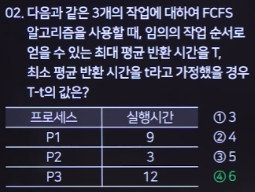
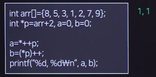

# 문제풀이

### 관계대수 & 관계해석

#### 문제1

#### 문제2

+ R2의 A와 B를 모두 포함하는 R1의 C2를 제외한 필드를 가져와야해!!!

### 데이터베이스

#### DDL

+ CREATE INDEX ~ ON ~
+ CREATE OR REPLACE VIEW ~ AS ~
+ CREATE TRIGGER ~ AFTER INSERT ON ~ FOR EACH ROW BEGIN ~ END
+ CREATE PROCEDURE (변수 IN 변수 OUT) ~ IS ~ BEGIN ~ EXCEPTION ~ END
+ 범위분할 : PARTITION BY RANGE (컬럼)
+ 목록분할 : PARTITION BY LIST (컬럼)
+ ALTER DROP COLUMN
+ TRUNCATE

#### DCL

+ GRANT UPDATE ON ~ TO ~ WITH GRANT OPTION
+ REVOKE UPDATE ON ~ FROM ~ CASCADE

#### DML

+ cross join : 반환 가능한 모든 값
+ SELECT DISTINCT 필드명

### 페이지 교체 알고리즘

+ FIFO : 제일 먼저
+ LRU : 가장 최근
+ LFU : 빈도수

### 프로세스 스케줄링

#### FCFS

#### SJF

+ 대기시간, 반환시간과 헷갈리지 말아라~

+ 비선점형이기 때문에 도착순서를 바꿀수가 없다..? 논란이 있겠네요..

#### SRT

+ 몇 초에 들어와서 몇 초에 나가는지 잘 계산하면 반환시간이 나옵니다.
+ 4초에 들어와서 5초에 나갔으면 반환시간은 1초

#### 라운드로빈

+ 도착시간이란건 없다...

+ P1의 실행시간 중 P2, P3, P4가 들어오면 상관없는데 실행 종료 후 대기큐에 들어간 이후에 들어오면 순서 바꿔줘야 합니다!!!

### 디스크 스케줄링

### C언어

#### 배열

+ char str[] = "abcde"; >>>>> 암묵적으로 뒤에 빈 공간 하나 있음 >>>>> 6
+ int num[] ={1,2,3,4,5}; >>>>> 4byte씩 다섯개 >>>>> 20

#### 포인터

+ *&pt >>>>> pt의 주소가 가진 값, pt가 참조중인 주소 그 자체

+ *p + 2 >>>>> p의 값은 K니까 K에 2를 더한 값 >>>>> M

+ 선증가, 후증가 제대로 체크!!

+ ary + 1 >>>>> 주소값에 1을 더했기 때문에 이상한 숫자 나옴

#### 포인터 배열

+ 주소값을 배열에 저장, 연속되는 개념이 아님 >>>>> bbb

 

#### 함수

+ x의 주소값 + 1을 한 후 그 자리의 주소값의 값에 2를 곱한것...!

+ fork() : 부모 프로세스 실행 후, 자식 프로세스 그대로 실행 >>>>> 2번 실행
+ 부모 프로세스는 0 이상, 자식 프로세스는 0, 실패했으면 -1

+ 무조건 부모 먼저 실행되는데, wait를 만나면 자식 먼저~

+ 실행중인 프로세스는 2^3, 새로 생긴 프로세스는 2^3-1

#### printf

+ int i = 5;

+ printf("%d, %d, %d, %d", i++, ++i, i++, ++i) >>>>> 8 9 6 9
+ printf는 뒤에서부터 연산을 시작
+ 연산을 만나기 전까지 어떤 값을 출력할지 알 수 없음....@@

### ++

+ int i = 5;
+ int z = ++i + ++i + ++i; >>>>> 7+7+8
+ +를 만나야 i가 결정된다...........

#### 콤마(,) 연산자

+ int a = ( 10, 20 ) >>>>> a = 20

+ 맨 뒤의 값 출력
