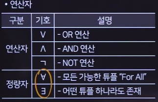
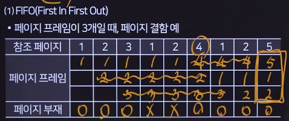
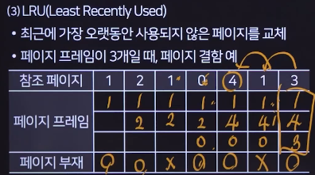
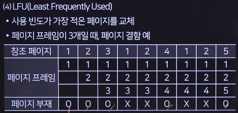
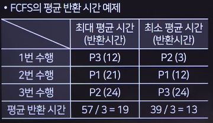
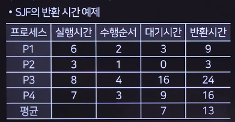
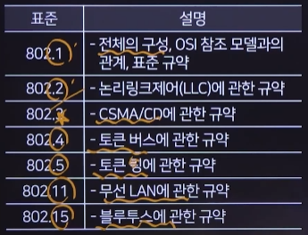
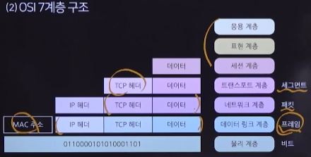
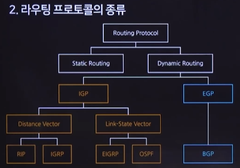

# 1장 소프트웨어 구축

## 1-1 소프트웨어 공학 개념

### 소프트웨어 공학

#### 정의

+ 효율적으로 품질 높은 소프트웨어를 개발하기 위한 학문

#### 3R

+ 역공학(Reverse) : 역으로 추적해 문서를 만드는 과정
+ 재공학 : 예방 유지보수의 측면, 분석-재구성-역공학-이관
+ 재사용 : 합성 중심(블록), 생성 중심(추상화)

#### 개발 단계

+ 계획 : 개발 범위(일정, 비용) > 클라이언트에서 주로 정의
+ 분석 : 고객의 요구사항 분석, 협상, 조율, 적합성
+ 설계 : 요구사항을 기준으로 시스템 구조-프로그램-인터페이스 설계 > 기획자가 스토리보드 작성
+ 구현 : 코딩, 디버깅, 단위 테스트
+ 테스트
+ 유지보수 : 비용이 가장 많이 드는 단계

### 소프트웨어 개발 방법론

#### 종류

+ 구조적 방법론 : 절차적
+ 정보공학 방법론 : 기업에서 사용하는 데이터 중심 방법론
+ 객체지향 개발 방법론 : 현실 세계의 객체를 속성과 동작으로 표현
+ CBD 분석 방법론 : 컴포넌트
+ 애자일 방법론 : 고객에 맞춰 빠르게 개발

#### 개발 모델

+ 폭포수 모델 : 순차적으로 접근, 각 단계가 명확, 가장 오래된 모형, 요구사항 변경이 어려움
+ 프로토타이핑 모델 : 시제품
+ 나선형 모델 : 계획-위험분석-개발-평가, 위험을 관리하고 최소화 목적
+ RAD (Rapid) : CASE 사용
+ V 모형 : 폭포수 모델 + 테스트, 단위-통합-시스템-인수
+ 4세대 기법 : 요구사항 명세서로부터 원시코드를 생성

#### 애자일(Agile) 방법론

+ 고객의 요구사항에 맞춰 신속하게 제공
+ XP(eXtream Programming) : 문서보다는 코드 중시
  + 5가지(용기-존중-의사소통-피드백-단순성)
  + 짝 프로그래밍, 계획 세우기, TDD, 고객 상주, 지속적 통합, 코드 개선, 작은 릴리즈, 코딩 표준, 공동 코드 소유, 간단한 디자인, 시스템 메타포어, 작업시간 준수
+ 스크럼(SCRUM) : 개발 주기마다 실제 동작할 수 있는 결과를 제공, 팀 단위, 매일 회의
  + 제품 백로그, 스프린트(개발 주기), 스프린트 계획 회의, 스프린트 백로그, 일일 스크럼
+ 크리스털, FDD(기능주도개발), ASD, lean

#### IT 서비스 관리

+ SLM(Service Level Management) : IT 서비스의 품질을 높이는 일련의 관리 및 활동
+ SLA : 서비스 수준을 명시적으로 정의한 문서
+ ITSM : SLA에 맞는 IT 서비스를 제공하는 것
+ ITIL : ITSM을 실현하는 도구 또는 방법

## 1-2 프로젝트 계획 및 분석

### 프로젝트 계획

#### 프로젝트 관리

+ 핵심 관리대상 (3P) : people, problem, process
+ PMBOK : PM에 필요한 자격증 > 어려움, 착수-계획-실행-통제-종료

#### 개발 비용 산정

+ 하향식 산정 기법 : 전문가 기법, 델파이 기법(전문가끼리 모여서)
+ 상향식 : 원시 코드 라인수(LOC : (낙관치 + (4*중간치) + 비관치) / 6)), M/M
+ 수학적
  + COCOMO : 조직형(Organic) 5만 이하, 반분리형(Semidetached) 30만 이하, 내장형(Embedded) 30만 이상
  + PUTNAM : Rayleigh-Norden 곡선의 노력 분포도 > 자동화 추정도구(SLIM)
  + 기능 점수 기법(Function Point) : 기능의 개수를 기준으로 측정, 자동화 추정도구(ESTIMACS)

#### 개발 일정 산정

+ WBS > PERT/CPM 네트워크 작성 > 최소 소요 기간(임계 경로) > 소요 M/M 기간 산정해 CPM 수정 > 간트 차트
+ WBS (Work Breakdown Structure) : 업무 세분화 > 요구사항 명세서 같네
+ 네트워크 차트 (PERT/CPM) : 
  + PERT : 기간이 정확하지 않을때, LOC와 같음
  + CPM : 듀폰, 레밍톤
+ 간트 차트 : 최종 산출물

### 요구사항 분석

#### 현행 시스템 분석

+ 플랫폼 : 하드웨어와 소프트웨어를 연결 > 유튜브, 구글
+ CPND (Contents Platform Network Device)
+ 운영체제 분석
+ 네트워크 분석
  + 프로토콜의 3요소 : 구문, 의미, 타이밍
+ DBMS 분석
+ 미들웨어 분석 : 원격 프로시저 호출, 메시지 지향 미들웨어(비동기), ORB, DB 접속(JDBC), TP 모니터(트랜잭션), WAS(동적처리), 엔터프라이즈 서비스 버스

#### 요구공학

+ 개념 : 고객의 요구를 체계적으로 도출
+ 요구사항 내용의 종류
  + 기능적 요구사항 : 기능 그 자체
  + 비기능적 요구사항 : 보안, 성능, 품질, 안정성
+ 요구사항 개발 프로세스
  + 도출 : 인터뷰, 관찰, 사용자 스토리, 시나리오, 설문조사, 브레인 스토밍, 포커스 그룹
  + 분석 : 구조적(DFD, ERD), 객체 지향(UML)
  + 명세 : 문서 작성, 정형-비정형
  + 확인
+ 요구사항 분석 도구
  + CASE 도구 : 상위 CASE(분석, 설계), 하위 CASE(구현, 테스트), 통합 CASE
  + HIPO : 하향식 소프트웨어 개발을 위한 문서화 도구(구조적)
    + 가시적 도표 : 전체 기능, 사이트맵
    + 총체적 도표 : 입출력처리에 대한 전반적 정보 제공
    + 세부적 도표 : 더 복잡

#### 요구사항 분석 모델링

+ 모델링 구분 : 기능적, 정적(클래스 다이어그램), 동적(순서, 상태, 커뮤니케이션 다이어그램)
+ 구조적 분석 모델
  + DFD : 가장 보편적, 도형 중심
  + DD : 회원정보 = 회원이름, 회원주소
  + 소단위 명세서
  + ERD : 개체(네모), 속성(원), 관계(마름모)
  + STD
+ 객체 지향 분석 모델
  + 럼바우 : 객(요구되는 객체를 찾아 객체들간의 관계) > 동(상태 다이어그램) > 기(DFD를 이용해 처리 과정을 표현)
  + Booch : 미시적, 거시적
  + Jacobson : use case
  + Coad와 Yourdon : ERD
  + Wrifs-Brock : 분석과 설계 간 구분 없음

## 1-3 소프트웨어 설계

### 소프트웨어 설계의 기본 원칙

+ 구체적인 설계서를 작성하는 단계
+ 상위설계, 하위설계(모듈, 자료구조, 알고리즘)
+ 설계 원리
  + 분할과 정복 : 큰 소프트웨어를 여러 개의 작은 서브 시스템으로 나눠 완성
  + 추상화 : 상위 레벨에서 핵심 위주로 단순화, 과정-데이터-제어
  + 단계적 분해
  + 모듈화
  + 정보은닉 
+ 설계 모델링 : 구조 모델링(정적), 행위 모델링(동적)
+ 협약에 의한 설계 : 선행 조건, 결과 조건, 불변 조건

### 소프트웨어 아키텍쳐

+ 소프트웨어의 골격이 되는 기본 구조

+ 간략성, 추상화, 가시성, 관점 모형, 의사소통수단

+ 4+1뷰

  + 논리적 관점 : 분석, 설계

  + 구현 관점 : 개발자의 관점

  + 배치 관점 : 시스템 엔지니어의 관점

  + 프로세스 관점 : 효율성, 성능

  + 사용자 관점 : use case

+ 품질 속성 : 정확성, 신뢰성, 효율성, 무결성 등등등...

+ 패턴 : 공통적인 발생 문제에 대한 재사용 가능한 해결책 > 프레임워크에 구현되어 있음

  + 계층화 패턴 : N-tier(OSI 7계층)
  + 클라이언트-서버 패턴
  + 마스터-슬레이브 패턴 : 단순 입출력(컴퓨터와 주변장치)
  + 파이프-필터 패턴 : 데이터 스트림(Unix 쉘처리)
  + 브로커 패턴 : 분산 시스템, 중간 역할
  + 피어 투 피어 패턴 : 파일 공유(P2P)
  + 이벤트-버스 패턴 : 단체 카톡, 알림 서비스
  + MVC
  + 블랙보드 패턴
  + 인터프리터 패턴 : 특정 언어로 작성된 프로그램 해석

### UML(Unified Modeling Language)

#### 개념

+ 프로그램 설계를 표현하기 위한 표기법
+ 가시화 언어, 명세화 언어, 구축 언어, 문서화 언어

#### UML 구성요소

+ 사물(Things)
+ 관계(Relationships)
  + 일반화 관계 : 상속관계(텅빈 삼각형 실선)
  + 실체화 관계 : 추상클래스, 한 객체가 다른 객체에게 오퍼레이션을 수행하도록 지정(텅빈 삼각형 점선)
  + 연관 관계 : 다른 클래스에서 제공하는 기능을 사용(꽉찬 삼각형 실선)
  + 의존 관계 : 한 메소드를 실행하는 매우 짧은 시간 유지(꽉찬 삼각형 점선)
  + 집합 관계 - 집약 관계 : has a, 서로 독립적(빈 다이아)
  + 집합 관계 - 합성 관계 : 긴밀한 필수적 관계(꽉찬 다이아)
+ 다이어그램
  + 구조 다이어그램 : 클래스, 객체, 컴포넌트, 배치, 복합체, 패키지 다이어그램
  + 행위 다이어그램 : 유스케이스, 시퀀스, 커뮤니케이션, 상태, 활동 다이어그램
    + 유스케이스 다이어그램
      + 시스템 : 만들고자 하는 프로그램 명칭
      + 액터 : 상호작용하는 사람, 시스템
      + 유스케이스 : 시스템의 기능
      + 관계 : 연관관계(실선), 포함관계(반드시실행>로그인), 확장관계(첨부파일), 일반화관계(상속)
    + 시퀀스 다이어그램 :  객체간의 상호작용 메시지 시퀀스를 시간의 흐름에 따라 구현
      + 객체와 생명선
      + 활성박스
      + 메시지 : 인스턴스 간 주고받은 데이터, 동기-비동기-자체-반환 메시지
    + 상태 다이어그램
      + 결제 준비 - 대기 - 완료

## 1-4 화면 설계

### UI 설계

#### 개념

+ UI : 정보기기와 사용자가 서로 상호작용을 할 수 있도록 연결해주는 매개체
+ UX : 사용자 경험

#### UI 유형

+ CLI : 커맨드 라인
+ GUI : 그래픽과 텍스트
+ NUI, OUI

#### UI 요구사항

+ 기능적
+ 비기능적

#### UI 설계 원칙

+ 직관성, 유효성, 학습성, 유연성

#### UI 설계 도구

+ 와이어프레임 : 파워포인트
+ 스토리보드 : 대부분의 정보 수록
+ 프로토타입 : HTML
+ 목업 : 실제 화면과 유사하게 만든 정적인 형태의 모형
+ 유스케이스

#### 감성공학

+ 심리학 + 인간공학 + 생산공학

### UI 구현

#### 화면 레이아웃 구성

+ 시맨틱 요소 : 검색 최적화의 목적
  + header, nav, aside, section, article, footer
+ HTML, CSS, JS

#### UI 관련 용어

+ 웹 표준
+ 웹 호환성 : 웹 표준을 지켜야 웹 호환성이 지켜짐
+ 웹 접근성 

## 1-5 서버 프로그램 구현

### 개발 환경 구축

#### 서버 환경 구축

+ 웹 서버 : 정적 파일을 제공하는 하드웨어 또는 애플리케이션 소프트웨어 (아파치)
+ WAS : 동적 웹 서비스를 제공하는 미들웨어가 설치된 하드웨어 (톰캣)
  + 미들웨어 : DB 조회
  + web login, jeus
+ 데이터베이스 서버(DBMS) : 오라클, mysql(퇴사하고 mariadb 만들었대), ms-sql
+ 파일 서버 : 사용자의 파일을 저장 > 공유
+ 로드밸런서 : 여러 대의 서버 요청을 분배
  + random, least, round robin
+ CDN(Content Delivery Network) : 사용자와 가까운 곳에 분산되어 있는 데이터 저장 서버, 사용자는 멀리있는 웹서버에서 직접 받는 것

+ 고려사항 : 확장성, 성능, 응답 시간, 처리량, 접근성, 일관성

#### 시스템 소프트웨어

+ 운영체제 : windows, linux, unix
+ JVM : java 구동 환경
+ 웹서버, WAS, DBMS

#### 개발 소프트웨어

+ 요구사항 관리 도구
+ 설계/모델링 도구 : UML 지원
+ 구현 도구 : IDE
+ 테스트 도구 : Junit, cppunit, jmeter, springtest
+ 형상관리 도구 : git, CVS, SVN

#### 기타 환경

+ IDE : 텍스트 에디터, 컴파일, 디버거, 배포, 추가 플러그인
+ 협업 도구 : Saas 기반

#### 형상 관리 도구

+ 소프트웨어 생명주기 동안 발생하는 변경사항을 통제하기 위한 관리 방법
+ 절차
  + 식별
  + 통제 : 소프트웨어 형상 변경 요청을 검토하고 승인해 현재의 베이스라인에 반영될 수 있도록 통제
  + 감사
  + 기록

#### 버전 관리 도구

+ 공유 폴더 방식 : RCS, SCCS > 내가 하던거..ㅎㅎ..
+ 클라이언트/서버 방식 : CVS, SVN > 중앙 버전 관리 시스템
+ 분산 저장소 방식 : git > 로컬과 원격 저장소 구조

#### 빌드/배포 도구

+ 빌드 : 소스코드 파일들을 실행 가능한 소프트웨어로 변환하는 과정
+ 지속적 통합(CI), 지속적 배포(CD)
+ Make(Unix), Ant, Maven(의존성 관리), jenkins(java, servlet), gradle(groovy, 안드로이드)

### 개발 프레임워크

#### 프레임워크

+ 여러 가지 기능을 제공해주는 반제품 형태의 소프트웨어
+ 특징 : 모듈화, 재사용성, 확장성, 제어의 역전
+ 구분
  + java : 전자정부, spring
  + ORM : hibernate, ibatis, mybatis (DTO, DAO, xml)
  + js : react, angular
  + frontend : 부트스트랩

#### 라이브러리

+ 특정 기능을 모아둔 클래스나 함수

#### API (Application Programming Interface)

+ 다른 종류의 소프트웨어에 서비스를 제공
+ tmdb api, 유튜브 api, 로그인 api

### 모듈 구현

+ 결합도를 낮추고 응집도를 높여야 함

#### 결합도

+ 한 모듈이 다른 모듈에 의존하는 정도
+ 자료(call by value)
+ 스탬프(call by reference)
+ 제외(내부변수)공(전역변수)내

#### 응집도

+ 모듈 내부 구성요소 간 연관 정도
+ 기순통(동일한 입력과 출력)절시논우

#### Fan-in, Fan-out

+ 팬인은 높게, 팬아웃은 낮게
+ 팬인 : 상위 모듈 수
+ 팬아웃 : 하위 모듈 수

#### 공통 모듈 구현

+ DTO, VO, DAO, Service, Controller, View

### 서버 프로그램 구현

#### MVC 계층

+ 프레젠테이션 계층 : 뷰
+ 제어 계층 : 컨트롤러
+ 비즈니스 로직 계층 : 핵심 업무 로직
+ 퍼시스턴스 계층 : DAO, 데이터베이스 CRUD
+ 도메인 모델 계층 : DTO

#### DBMS

+ DML(조작) 사용
+ 소켓통신, vender API, JDBC(표준 API), ODBC

#### ORM

+ 객체와 관계형 데이터베이스의 데이터를 매핑
+ SQL mapper : mybatis, ibatis
+ OR mapping : JPA, hibernate

#### 시큐어 코딩

+ OWASP : 10대 취약점
+ 입력 데이터 검증 및 표현 : sql injection, xss, 자원 삽입, 파일 업로드, 명령 삽입, 메모리 버퍼 오버플로
+ 보안 기능 : 인증, 인가, 취약한 암호화 알고리즘, 하드코딩된 패스워드, 패스워드 평문 저장
+ 시간 및 상태 : 경쟁 조건, 재귀함수
+ 에러 처리 : 오류 메시지, 예외 처리
+ 코드 오류 : 널 포인트, 자원, 초기화되지 않은 변수
+ 캡슐화 : 세션 간 데이터, 접근 지정자, 디버그 코드, 시스템 정보 노출
+ API 오용 : DNS

### 배치 프로그램 구현

#### 배치

+ 일괄적으로 모아서 처리
+ 필수 요소 : 대용량 데이터, 자동화, 견고함, 안정성, 성능

#### 스케줄 관리 종류

+ 크론탭(crontab) : Unix, Linux 계열에서 사용 (분 시 일 월 요일 명령어)
  + \*****명령 : 매분 실행
  + 30 4 * * 0 명령 : 매주 일요일 4시 30분 실행
  + */30 * * * * 명령 : 매 30분마다 실행
  + 30 0 1 1,6 * 명령 : 1월 6월, 1일 0시 30분에 실행
+ 스프링 배치
+ quartz job scheduler

## 1-6 인터페이스 구현

### 인터페이스 개요

#### 인터페이스 시스템

+ 서로 다른 시스템, 장치 사이에서 정보를 주고받을 수 있도록 도움을 주는 시스템
+ 전문 공통부, 전문 개별부(데이터), 전문 종료부

+ 인터페이스 목록 : 기능 정리
+ 인터페이스 정의서 : 상세 내용

### 인터페이스 기능 구현

#### 내/외부 모듈 연계 방식

+ EAI(Enterprise Application Integration) : 기업간의 정보 전달을 목적으로 하는 솔루션
+ 구축 유형
  + point to point : 미들웨어 없이 연결
  + hub & spoke : 허브를 통해 전송하는 중앙 집중식 방식
  + message bus : 미들웨어
  + hybrid : 내부는 bub & spoke 외부는 message bus
+ ESB(Enterprise Service Bus) : 버스를 통해 이기종 애플리케이션을 유연하게 통합하는 플랫폼
  + 통합 측면에서 EAI와 유사하지만 애플리케이션 보다는 서비스 중심

#### 인터페이스 연계 기술

+ Link : DB 링크 객체
+ DB connection : WAS에서 DB 연결하는 커넥션 풀을 생성
+ JDBC
+ API/OpenAPI
+ Web service : WSDL(xml 설명서), UDDI(WSDL 모아놓는 공간), SOAP(실제 프로토콜)
+ 하이퍼링크
+ 소켓 : 클라이언트와 직접 연결

#### 인터페이스 전송 데이터

+ JSON : 이름과 값의 쌍
+ XML : 마크업 언어
+ YAML : 데이터 직렬화 언어, 공백 위주로 구분
+ CSV : Comma

#### 인터페이스 구현

+ AJAX : 비동기
  + 단점 : 히스토리 관리가 안됨, 사용자에게 진행 정보가 없음, 보안 문제
+ SOAP(Simple Object Access Protocol) : 
  + XML 기반 메시지를 네트워크 상에서 교환하는 프로토콜, RPC 패턴
  + RESTful 보다 상대적으로 개발이 어려움
  + SOA : 서비스 지향 아키텍쳐
  + WSDL(xml 설명서), UDDI(WSDL 모아놓는 공간), SOAP(실제 프로토콜)
+ REST : URI를 통해 자원 명시, CRUD 적용
  + ROA : 자원 지향 아키텍쳐
  + 유니폼 인터페이스, stateless, cacheable, 자체 표현 구조
  + 단점 : 표준이 없음, 관계형 DB와 맞지 않음

#### 인터페이스 보안

+ 네트워크 영역 : IPSec, SSL, S-HTTP
+ 애플리케이션 영역 : 시큐어 코딩
+ DB 영역

### 인터페이스 구현 검증

#### 구현 검증 도구

+ xUnit : 다양한 언어를 지원하는 단위 테스트 프레임워크
+ STAF : 서비스 호출, 컴포넌트 재사용
+ FitNesse : 웹 기반 테스트케이스 설계
+ NTAF : FitNesse + STAF 네이버에서 개발
+ Selenium : 웹 애플리케이션 테스트 프레임워크
+ watir : 루비

#### 구현 감시 도구

+ scouter, jennifer
+ APM을 사용해 동작 상태 감시

## 1-7 객체지향 구현

### 객체지향 설계

#### 객체지향

+ 개념 : 현실 세계에 존재하는 유형, 무형의 대상의 속성과 행동을 정의해 객체로 만들고 객체를 조립해 프로그램을 설계하는 방법
+ 구성요소
  + 클래스 : 설계도, 데이터 추상화 단위
  + 객체(인스턴스) : 클래스로부터 만들어진 객체, 실제 메모리에 올라감
  + 속성 : 필드
  + 메소드 : 명령문의 집합
  + 메시지 : 객체의 메소드 호출

#### 객체지향 언어의 특징

+ 캡슐화 : 속성과 메소드를 하나로 묶어 외부로부터 데이터를 보호, 캡슐화된 객체들은 세부 내용을 알 필요가 없으므로 재사용이 용이하고 결합도가 낮아짐
+ 상속 : 부모클래스의 메소드를 자식클래스에서 재정의, 재사용 > 확장
+ 추상화 : 공통의 성질을 추출해 모델링
+ 다형성 : 동일한 코드를 사용해 다양한 유형의 객체를 처리할 수 있음
  + 오버로딩 : 동일한 메소드명의 매개변수만 다르게 해서 사용
  + 오버라이딩 : 상속

#### 객체지향 설계원칙(SOLID)

+ 단일 책임 원칙(SRP) : 하나의 클래스는 하나의 책임
+ 개방 폐쇄 원칙(Open-Closed Principle) : 확장에는 개방, 수정에는 폐쇄 > 추상화 쓰면 됨
+ 리스코프치환(LSP) : 상속받은 클래스는 언제나 대체 가능해야 함
+ 인터페이스 분리 원칙(ISP) : 사용하지 않는 인터페이스는 구현하지 않아야 함
+ 의존성 역전 원칙(DIP) : 자주 변하지 않는 것에 의존해야 함 > 추상 클래스나 인터페이스

#### 디자인 패턴

+ 개념 : 자주 발생하는 문제들에 대해 재사용할 수 있도록 만들어놓은 패턴의 모음
+ GoF
+ 생성 : 
  + 추상 팩토리
  + 빌더(생성자의 다른 표현)
  + 팩토리 메소드(서브클래스로 위임)
  + 프로토타입(원본 객체를 복사)
  + 싱글톤(하나의 인스턴스)
+ 구조 : 
  + 어댑터(다른 인터페이스로 변환)
  + 브릿지(구현부, 추상부 분리)
  + 컴포지트(트리 구조)
  + 데코레이터
  + 파사드(가장 앞쪽)
  + 플라이웨이트
  + 프록시(대리)
+ 행위 : 
  + 책임 연쇄
  + 커맨드(요청을 객체의 형태로 캡슐화)
  + 인터프리터
  + 반복자
  + 중재자(같은 집합의 상호작용을 새로운 객체)
  + 메멘토
  + 옵저버(자동 갱신)
  + 상태
  + 전략(동일 계열의 알고리즘)
  + 템플릿 메소드
  + 방문자(개방 폐쇄 원칙)

## 1-8 애플리케이션 테스트 관리

### 테스트케이스 설계

#### 소프트웨어 테스트

+ 개념 : 소프트웨어의 결함을 찾아내는 활동
+ 오류 발견 관점, 오류 예방 관점, 품질 향상 관점
+ 결함 집중 : 파레토 법칙
+ 살충제 패러독스 : 내성 생김 > 주기적으로 테스트케이스를 리뷰하고 개선
+ 오류-부재의 궤변
+ 테스트케이스 : 입력 값, 테스트 조건, 기대 결과
+ 테스트시나리오 : 여러 개의 테스트케이스의 집합

#### 테스트 오라클

+ 사전에 정의된 참 값을 입력해 결과를 비교하는 기법 및 활동
+ 참 오라클 : 크리티컬한 업무에 대해 모든 테스트케이스 실행
+ 샘플링 오라클 : 중요한 업무에 대해서만
+ 휴리스틱 오라클 : 샘플링 오라클을 개선해 중요한 업무는 처리하고 나머지는 추정으로 처리
+ 일관성 검사 오라클 : 변경이 있을 때 변경 전과 후의 결과가 동일한지 확인

#### 테스트 레벨

+ 단위 테스트 : 정적, 동적
+ 통합 테스트 : 상향식, 하향식, 빅뱅, 백본
+ 시스템 테스트 : 기능, 비기능
+ 인수 테스트 : 알파, 베타

#### 소프트웨어 테스트 기법

+ 실행 여부
  + 정적 테스트 : 소스코드 내부의 논리적 구조
  + 동적 테스트 : 실행하여 실제 발생하는 오류를 발견
+ 테스트 기법
  + 화이트박스 테스트 : 내부 구조와 동작을 검사
  + 기초 경로 테스트 : Macabe의 순환 복잡도, V(G) = E-N+2
  + 블랙박스 테스트 : 사용자 관점의 테스트 방법
    + 동등 분할 기법(Equivalence Partitioning) : 중간값
    + 경계값 분석(Boundary Value) : 중간값보다 경계값
    + 원인-효과 그래프 검사(Cause-Effect Graphing) : 입력 데이터 간의 관계와 출력
    + 오류 예측 검사(Error Guessing) : 과거의 경험 
    + 비교 검사(Comparison) : 여러 버전의 프로그램에 테스트
+ 테스트에 대한 시각
  + 검증(Verification) : 개발 과정
  + 확인(Validation) : 결과를 테스트
+ 테스트 목적
  + 회복 : 고의로 실패를 유도
  + 안전 : 보안
  + 강도 : 과부하
  + 성능
  + 구조
  + 회귀 : 수정된 코드
  + 병행
  + A/B 테스트 : 새로운 서비스가 정말 효과가 있는지
  + 스모크 테스트 : 테스트 환경을 테스트
+ 테스트 종류
  + 명세 기반 테스트 
  + 구조 기반 테스트 : 내부 논리 흐름
  + 경험 기반 테스트

#### 테스트 커버리지

+ 테스트를 얼마나 수행했는지 측정하는 기준
+ 기능 기반 커버리지 : 전체 기능 중 얼마나
+ 라인 커버리지 : 소스코드의 전체 라인, 단위 테스트
+ 코드 커버리지 : 소스코드의 구조
  + 조건 커버리지 : 개별 조건식
  + 결정 커버리지 : 결정포인트
  + 조건/결정 커버리지
  + 변경 조건/결정 커버리지 : 모든 조합

### 애플리케이션 통합 테스트

#### 결함관리 도구

+ 결함관리를 위한 특정 목적의 게시판 같은 것
+ 에러 발견 > 에러 등록 > 에러 분석 > 결함 확정 > 결함 할당 > 결함 조치 > 검토 및 승인
+ 결함 관리 측정 지표 : 결함 분포, 결함 추세, 결함 에이징

#### 테스트 자동화 도구

+ 반복되는 테이스 데이터 재입력 작업 자동화
+ 어렵대...ㄷㄷ
+ 도구 유형
  + 정적 분석 도구 : pmd, sonarqube, cppcheck, checkstyle, cobertura
  + 테스트 실행 도구
  + 성능 테스트 도구 : 강도 테스트 할 때 사용
  + 테스트 통제 도구 
  + 테스트 장치(test harness)
    + 테스트 드라이버 : 상향식
    + 테스트 스텁 : 하향식
    + 테스트 슈트 : 테스트 케이스의 집합
    + 테스트 케이스 : 입력 값, 실행 조건, 기대 결과
    + 테스트 스크립트
    + 목 오브젝트 : 조건부로 사전에 행위를 입력

#### 통합 테스트

+ 점증적 :  상향식, 하향식, 백본
+ 비점증적 : 빅뱅

### 애플리케이션 성능 개선

#### 성능 저하 원인

+ 데이터베이스 관련
  + 데이터베이스 락 : 대량의 데이터
  + 불필요한 패치 : select...!
  + 연결 누수 : 커넥션 사용 후 반환하지 않을 때
+ 내부 로직 관련

#### 성능 분석

+ 성능 분석 지표
  + 처리량
  + 응답 시간 : 응답이 도착할 때 시간
  + 반환 시간 : 처리가 완료될 때까지 시간
  + 자원 사용률
+ 성능 분석 도구
+ 모니터링 도구

#### 정형 기술 검토회의(Formal Technical Review)

+ 공식 회의

#### 소스코드 품질 분석

+ 동료 검토 : 2-3명 리뷰
+ 워크스루 : 팀 회의
+ 인스펙션 : 공식적 검사 회의, 다른 전문가가 검사
  + 계획 > 사전교육 > 준비 > 인스펙션회의 > 수정 > 후속조치

#### 코드 최적화

+ 리팩토링
  + 기능을 바꾸지 않으면서 내부 구조를 개선하는 작업
+ 코드 스멜
  + 중복된 코드
  + 긴 메소드
  + 큰 클래스 : 단일 책임 원칙
  + 클래스 동시 수정 : 의존성 역전 원칙

## 1-9 소프트웨어 유지보수

### 소프트웨어 유지보수

#### 유지보수의 구분

+ 수정 보수(Corrective) : 테스트에서 발견하지 못한 잠재적인 오류
+ 적응 보수(Adaptive) : 환경변화
+ 향상 보수(Perfective) : 추가 기능, 가장 많은 비용 발생
+ 예방 보수(Preventive) : 재공학 

#### 유지보수의 비용 예측 방법

+ 주먹구구, Belady Lehman, COCOMO, SMI

#### 관련 용어

+ 레거시 시스템
+ 외계인 코드 : 역공학을 통해 문서화!!!!!
+ 스파게티 코드

### 제품 소프트웨어 패키징

#### 제품 품질 국제 표준

+ ISO/IEC 9126
  + 기능성
  + 신뢰성
  + 사용성
  + 효율성
  + 유지보수성
  + 이식성
+ ISO/IEC 14598
  + 반복성 : 내가 내 컴퓨터에서 테스트
  + 재현성 : 다른 사람 컴퓨터에서 테스트
  + 공정성
  + 객관성
+ ISO/IEC 12119 : 품질 표준 + 테스트
+ ISO/IEC 25000

#### 프로세스 품질 국제 표준

+ 소프트웨어 업체의 프로세스 관리 능력을 평가
+ ISO/IEC 12207 : 생명주기
  + 기본 생명주기 프로세스
  + 지원 생명주기 프로세스 : 문서화, 형상관리
  + 조직 생명주기 프로세스
+ ISO/IEC 15504(SPICE) : 0단계 ~ 5단계
  + 불안정 > 수행 > 관리 > 확립(표준 프로세스) > 예측(정량적 측정) > 최적화
+ CMM(Capability Maturity Model) : 미국 국방부
  + 초기 > 반복 > 정의 > 관리 > 최적화
+ CMMI : CMM + SE, PM
  + 초기 > 관리 > 정의 > 정량적 관리 >최적화

#### 서비스 관리 국제 표준

+ ISO/IEC 20000

#### 애플리케이션 패키징

+ 배포용 설치 파일
+ 릴리즈 노트
+ 기능 식별 > 모듈화 > 빌드 진행 > 사용자 환경 분석 > 패키징 적용 시험 > 패키징 변경 개선

#### 애플리케이션 배포

+ CI(Continuous Integration) : 지속적인 통합
+ CD(Continuous Delivery & Deployment) : 지속적인 배포

#### DRM(Digital Rights Management)

+ 디지털 콘텐츠의 사용 권리를 제어
+ 콘텐츠 제공자 : 콘텐츠 + 메타 데이터 = 패키저
+ 클리어링 하우스 : 라이선스, 권한정책
+ 콘텐츠 분배자 : 유통 시스템
+ 콘텐츠 소비자 : DRM 컨트롤러, 보안 컨테이너
+ 워터마킹
  + 워터마킹 : 불법 복제 방지, 저작권 정보, 최조 저작 시점
  + 핑거프린팅 : 불법 유통 방지, 저작권 정보 + 구매자 정보, 구매시점마다

# 2장 데이터베이스

## 2-1 데이터베이스 구축

### 데이터베이스 개념

#### 데이터베이스의 정의

+ 통합 데이터 : 중복 최소화된 데이터
+ 저장 데이터 : 저장매체
+ 운영 데이터 : 조직의 목적
+ 공유 데이터 : 여러 응용 프로그램

#### 데이터 언어

+ DDL : 스키마에 사용되는 제약 조건을 정의
+ DML : CRUD
+ DCL : 보안 및 권한 제어, 무결성, 회복, 병행 제어

#### 스키마

+ 구조와 제약조건에 대해 명세
+ 3계층
  + 외부 스키마 : 사용자 뷰
  + 개념 스키마 : 전체적인 뷰, 전체적인 논리적 구조, 하나만 존재
  + 내부 스키마 : 물리적 저장 스키마
+ 데이터 독립성
  + 논리적 독립성 : 외부 - 개념
  + 물리적 독립성 : 개념 - 내부

#### DBMS

+ 계층형(Hierarchical) : 다대다 안됨
+ 네트워크형 : 망형 모델, 유지보수 어려움, CODASYL
+ 관계형 : 키-밸류, SQL
+ 객체지향형 : 비정형 데이터(영상, 음악)
+ 객체 관계형
+ NoSQL : 비정형 데이터
+ NewSQL

### 데이터베이스 설계

#### 설계 개요

+ 고려사항 : 제약조건, 데이터베이스 무결성, 일관성, 회복, 보안, 효율성, 데이터베이스 확장성
+ 개념적 설계 : ERD
+ 논리적 설계 : 목표 DBMS(관계형, 객체지향형..), 정규화, T/I
+ 물리적 설계 : 특정 DBMS(오라클, mysql), 성능 고려

### 데이터 모델링

#### 데이터 모델

+ 데이터모델 표시 요소
  + 구조
  + 연산
  + 제약조건
+ 품질 기준 : 정확성, 완전성, 준거성, 최신성, 일관성, 활용성

#### ERD

+ 개체
+ 속성
  + 단일 값
  + 다중 값
  + 단순 : 성별
  + 복합 : 주소, 이중 타원
  + 기본키 : 밑줄 타원
+ 관계

### 논리 데이터베이스 설계

#### 논리적 데이터모델링

+ 목표 DBMS > 관계 모델

#### 데이터베이스 정규화

+ 이상 현상 : 데이터 중복으로 인해 릴레이션 조작 시 예상하지 못한 곤란한 현상
  + 삽입 이상 : 불필요한 데이터가 함께 삽입되는 현상
  + 삭제 이상 : 한 튜플을 삭제할 때 연쇄 삭제 현상으로 인해 정보 손실
  + 갱신 이상 : 일부 튜플만 갱신되어 정보에 모순이 생기는 현상
+ 함수적 종속 : x의 값을 알면 y의 값을 바로 식별할 수 있을 때, X->Y
  + 완전 함수적 종속 : 주민번호 -> 이름 / 회원번호+주문번호 -> 강의명
  + 부분 함수적 종속 : 두 개 이상의 속성으로 구성된 기본키가 있을 때, 모두 다 만족하지 않고 일부에만 종속될 때
  + 이행적 함수 종속(Transitive) : X->Y, Y->Z, X->Z

#### 정규화 과정

+ 1정규화 : 도메인이 원자값
  + 고객번호 - 이름 - 여행지 : 하나의 고객이 여러 여행지를 가질 수 있을 때 원자값 분리
+ 2정규화 : 부분 함수적 종속 제거
  + 복합키 중 일부만 종속될 때 이것을 제거하고 복합키 모두에 종속되게 만들어야 함
  + 학생아이디 - 강의아이디 - 강의이름 : 강의이름은 강의아이디에만 종속된다~
+ 3정규화 : 이행적 함수 종속 제거
  + 기본키에 직접 종속된 속성만을 포함하는 것이 목적
  + 주문번호 - 고객아이디 - 고객명 : 고객명까지는 필요없다~
+ BCNF : 결정자이면서 후보키가 아닌 것 제거
+ 4정규화 : 다치 종속 제거
+ 5정규화 : 조인 종속성 이용

### 물리 데이터베이스 설계

#### 설계 과정

+ 특정 DBMS, 데이터 타입, 반정규화, 인덱스, DB생성

#### 반정규화

+ 시스템의 성능향상을 위해 정규화에 위배되는 중복을 허용하는 기법
+ 하다하다 안되면...해... > 인덱스, 클러스터링, 파티셔닝, 뷰

#### 데이터베이스 이중화

+ 고가용성을 위해 동일한 데이터베이스를 중복시켜 동시에 갱신해 관리
+ Eager : 변경 즉시 / Lazy : 트랜잭션 단위
+ Hot standby : 즉시 사용 가능

#### 데이터베이스 백업

+ 백업 방식

  + 풀 백업 : 모든 데이터

  + 증분 백업 : 풀 백업 이후 변경/추가된 데이터만

  + 차등 백업 : 풀 백업 이후 변경/추가된 데이터를 모두 포함해 백업

  + 실시간 백업

  + 트랜잭션 로그 백업 : 모든 SQL문을 기록

  + 합성 백업 : 전체 + 여러 개의 증분

+ 복구 시간 목표/복구 시점 목표

  + RTO : 중단 시점과 복원 시점 간에 허용되는 최대 지연 시간, 2시간 안에 살려라!
  + RPO : 마지막 복구 시점과 중단 시점 사이에 허용되는 데이터 손실량

#### 데이터베이스 암호화

+ API : 애플리케이션에서 수행
+ 플러그인 : 제품을 설치
+ TDE(Transparent Data Encryption) : DB에서 제공하는 기본 방식

### 데이터베이스 물리속성 설계

#### 파티셔닝

+ 데이터베이스를 여러 부분으로 분할하는 것
+ 샤딩(Sharding) : 여러 개의 작은 조각으로 나누어 분산 저장
+ 장점 : 가용성, 관리용이성, 성능
+ 단점 : join 비용 증가
+ 종류
  + 수평 분할(Ho) : 스키마를 복제한 후 샤드키를 기준으로 데이터를 나눔, 구조가 같음
  + 수직 분할(Ver) : 자주 사용하는 컬럼 등을 분리
+ 분할 기준
  + 범위 분할 : 월별, 분기별 > range
  + 목록 분할 : 특정 그룹 > list
  + 해시 분할 : 병렬 처리
  + 라운드 로빈 분할 : 균일하게 분배
  + 합성 분할 : 복합적으로 사용

#### 클러스터

+ 자주 사용되는 데이터를 디스크의 같은 위치에 저장시키는 방법
+ 저장, 수정, 삭제, Full scan 성능 저하

#### 인덱스

+ 테이블의 검색 속도를 향상시키기 위한 자료구조 > 색인
+ 종류
  + 클러스터 인덱스 : 테이블당 1개만 허용, 기본키
  + 넌클러스터 인덱스 : 테이블당 약 240개 생성 가능, 인덱스 페이지만 정렬, hint
  + 밀집 인덱스
  + 희소 인덱스
+ 인덱스의 구조
  + 트리 기반 인덱스 : B+ 트리
  + 비트맵 인덱스
  + 함수 기반 인덱스
  + 비트맵 조인 인덱스
  + 도메인 인덱스
+ REBUILD

#### 뷰

+ 논리적으로 존재하는 가상 테이블
+ ALTER 변경 불가능
+ CREATE OR REPLACE : 생성하거나 드롭 후 생성하거나

#### 시스템 카탈로그

+ DB 관리를 위해 DBMS가 자체적으로 만든 시스템 테이블

+ 시스템 테이블 = 데이터 사전 = 메타 데이터
+ 릴레이션, 인덱스, 뷰, 통계, 사용자 관련 정보

### 관계 데이터베이스 모델

#### 관계 데이터 모델

+ 행 = 튜플, 차수(degree) = 속성의 개수, 카디널리티 = 튜플의 개수, 도메인 = 속성의 범위
+ 릴레이션 스키마, 릴레이션 인스턴스
  + 릴레이션 안에는 같은 튜플이 존재할 수 없음
  + 순서가 없음

#### 관계 데이터 언어(관계대수, 관계해석)

+ 관계 대수 : 절차적인 언어
+ 순수 관계 연산자
  + SELECT : 시그마, AND(^), OR(v) >>> 시그마 성적 > 90 (학생) : 학생 테이블에서 성적이 90 초과
  + PROJECT : 파이<리스트>(릴레이션) >>> 파이 학번, 성적 (학생) : 학생 테이블에서 학번, 성적 컬럼
  + JOIN : 릴레이션 보타이 <조건>릴레이션 >>> (학생) 보타이 학번=학번 (수강과목)
  + DIVISION : (R) 나누기 (S1) >>> R에서 S1이 가진 모든 항목이 일치하는 S1을 제외한 필드
+ 일반 집합 연산자
  + 합집합(Union) : 중복은 제거
  + 교집합(Intersection) : 겹치는거
  + 차집합(Difference) : 겹치는거 빼기
  + 교차곱(Cartesian Product) : 존재하는 모든 순서쌍
+ 관계 해석 : 비절차적 특성, 목표만 명시하면 알아서 함

### 키와 무결성 제약조건

#### 키

+ 슈퍼키 : 식별만 가능하면 됨, 유일성 >>> 학번 + 주민번호
+ 후보키 : 유일성 + 최소성 >>> 학번 따로 주민번호 따로
  + 기본키
  + 대체키 : 후보키가 둘 이상일 때 기본키를 제외한 키
+ 외래키 : 참조키

#### 데이터베이스 무결성

+ 개체 무결성 : 기본키를 가져야 함, 기본키는 중복과 Null 불가
+ 참조 무결성 : 외래키
  + 제한(restrict) : 참조 중인 키가 삭제될 때 연산 거절
  + 연쇄(cascade) : 부모 테이블 튜플 삭제 시 참조중인 튜플 함께 삭제
  + 널값
  + 기본값
+ 도메인 무결성 : 속성에 정의된 범위의 값만 사용해야함 >>> 성별 필드는 남, 여만 가능
+ 고유 무결성
+ 키 무결성
+ 릴레이션 무결성

### 물리데이터 모델 품질 검토

#### CRUD

+ 필요성 : 모델링 작업검증, 중요 산출물, 테스트 시 사용, 인터페이스 현황 파악

#### 옵티마이저

+ SQL > 구문분석(Parsing) > 실행(Execution) > 추출(Fetch) > 결과
+ 규칙기반 옵티마이저 : 우선순위를 가지고 생성
+ 비용기반 옵티마이저 : 통계정보를 가지고 비용이 가장 적은 실행계획을 선택

#### SQL 성능 튜닝

+ SQL문을 최적화해 데이터베이스 성능 개선
+ Row Migration : 데이터가 더 커져서 못들어가는 경우 다른 블록에 넣고 주소를 남김
+ Row Chaining : 두개의 블록에 이어서

### 분산 데이터베이스

#### 정의

+ 여러 곳으로 분산되어있는 데이터베이스를 하나의 가상 시스템으로 사용할 수 있도록 만든 DB
+ 구성요소 : 분산 처리기, 분산 데이터베이스, 통신 네트워크
+ 테이블 요약 분산
  + 분석요약 : 같은 구조의 정보를 마스터에서 통합
  + 통합요약 : 다른 내용의 정보를 마스터에서 통합

#### 투명성 조건

+ 위치 투명성(Location) : 데이터베이스의 위치는 알 필요없음
+ 분할 투명성(Division) : 각 단편의 사본이 여러 위치에 저장
+ 지역사상 투명성(Local Mapping) : 지역 DBMS와 물리적 DB 사이의 매핑 보장
+ 중복 투명성(Replication) : 여러 곳에 중복되어 있어도 알빠노..
+ 병행 투명성(Concurrency) : 다수의 트랜잭션이 동시에 실행되더라도 알빠노...
+ 장애 투명성(Failure) : 장애에도 불구하고 트랜잭션을 정확히 처리함

#### CAP 이론

+ 어떤 분산 환경에서도 일관성, 가용성, 분단 허용성 중 두 가지만 가질 수 있음
+ Consistency
+ Availablility
+ Partition Tolerance

#### 트랜잭션

+ 데이터베이스 상태를 변화시키는 하나의 작업 단위
+ 원자성(Atomicity) : 모두 반영되거나 모두 반영되지 않거나, commit과 rollback
+ 일관성(Consistency) : 완료되면 일관성있는 데이터베이스 상태로 변환
+ 독립성(Isolation) : 둘 이상의 트랜잭션이 실행될 때 다른 연산이 끼어들 수 없음
+ 영속성(Durability) : 고장이 나더라도 영구적 반영
+ 트랜잭션의 상태
  + 활동(Active)
  + 실패(Failed) : 오류 발생으로 중단된 상태
  + 철회(Aborted) : 롤백을 수행한 상태
  + 부분 완료(Partially Committed) : 커밋 직전
  + 완료(Committed) : 커밋 완료

## 2-2 SQL 활용

### 기본 SQL 작성

#### SQL

+ DDL : Create, Alter, Drop, Rename, Truncate(초기화)
+ DML : Select, Insert, Update, Delete
+ DCL : Grand, Revoke
+ TCL : Commit, Rollback, Savepoint

#### DDL(Definition)

+ 스키마, 도메인, 테이블, 뷰, 인덱스
+ create
+ alter 
  + 속성 추가/변경/삭제 : alter table (테이블명) add/modify/drop (속성명)
  + 인덱스 변경/재구성/비활성화 : alter index (인덱스명) rename to/rebuild/unsuable
+ drop
+ truncate : 데이터 삭제, 초기화, 시퀀스까지 초기화
+ 제약조건 : unique, not null, check

#### DML(Manipulation)

+ INSERT INTO 테이블명 (필드1, 필드2,,,) VALUES (값1, 값2,,,)
+ SELECT * FROM 테이블명 WHERE 조건
  + SELECT 부서, COUNT(*) AS 인원수 FROM 사원정보 GROUP BY 부서
+ UPDATE 테이블명 SET 컬럼수정내용
+ DELETE FROM 테이블명 WHERE 조건

#### DCL(Control)

+ GRANT SELECT ON 테이블명 TO 사용자명 WITH GRANT OPTION
+ REVOKE SELECT ON 테이블명 FROM 사용자명 CASCADE

#### TCL

+ COMMIT, ROLLBACK, SAVEPOINT

### SELECT 쿼리 활용

#### 집합 연산자

+ UNION : 중복 제거
+ UNION ALL : 중복 포함
+ INTERSECT : 교집합
+ EXCEPT : 차집합

#### JOIN

+ inner join : 공통의 레코드만 추출
+ natural join
+ outer join
  + full : 두 테이블의 컬럼 모두 추출되고 나머지는 null
    + col1 col2 col2 col3
  + left : 좌측 테이블 기준
  + right : 우측 테이블 기준
+ cross join : 모든 조합을 반환

#### 서브쿼리

+ 스칼라 : SELECT문 안에 SELECT, 단일행, 단일값
+ 인라인뷰 : FROM절 안에
+ 중첩 : WHERE절 안에
  + IN
  + EXISTS : IN 보다 속도 조금 빠름
  + ANY : 하나라도 만족하면 참
  + ALL : 둘 다 만족해야 참

### 그룹함수와 윈도우 함수

#### 그룹함수와 집계함수

+ 그룹함수 : rollup(중간 결과 나옴), cube, grouping sets
  + group by : 두 개 이상의 필드도 가능
+ 집계함수 : count, sum, avg, max, min

#### 윈도우 함수

+ OLAP : OVER가 들어감
+ RANK : 1, 2, 2, 4
+ DENSE_RANK : 같은 순위는 같은 걸로 취급 (1, 2, 2, 3)

### 절차형 SQL

#### 저장 프로시저(Stored Procedure)

+ 일련의 쿼리를 하나의 함수처럼 실행하기 위한 쿼리의 집합, 모듈
+ 장점 : 절차적 기능 구현, 개발 업무 구분, DB 보안 향상, 네트워크 소요 시간 절감
+ 단점 : 낮은 처리 성능, 유지보수 어려움
+ CREATE OR REPLACE PROCEDURE 프로시저명 (IN, OUT, IN OUT) IS BEGIN EXCEPTION END;

#### 트리거

+ 특정 테이블에 DML문이 수행됐을 때, DB에서 자동으로 동작하도록 작성된 프로그램
+ 행 트리거 : OLD, NEW, FOR EACH ROW 옵션 사용
+ 문장 트리거 : 단 한번만 실행

#### 사용자 정의 함수(Stored Function)

+ 리턴값이 하나
+ CREATE OR REPLACE FUNCTION 함수명 (매개변수) RETURN IS BEGIN EXCEPTION END;

## 2-3 병행제어와 데이터 전환

### 병행제어와 회복

#### 병행제어

+ 여러 트랜잭션이 동시에 실행되면서도 데이터베이스의 일관성을 유지할 수 있게 하는 기법
+ 문제점
  + 갱신 분실(Lost Update) : 같은 자료를 공유할 때 데이터가 분실됨
  + 비완료 의존성(Uncommitted Dependency) : 실패 후 롤백되기 전에 다른 애가 참조하는 현상
  + 모순성(Inconsistence) : 여러 데이터..?
  + 연쇄 복귀(Cascading Rollback) : 어느 하나에 문제가 생겨 롤백되는 경우 다른 애도 롤백

#### 병행제어 기법

+ 로킹 : 다른 트랜잭션이 접근할 수 없음
  + 로킹 단위가 크면 > 공유도(병행성), 로크, 오버헤드 감소
  + 로킹 단위가 작으면 > 공유도(병행성), 로크, 오버헤드 증가
+ 2단계 로킹 규약 : 확장단계, 축소단계
+ 타임스탬프 : 정해진 시간의 순서대로 접근
+ 낙관적 병행제어 : 종료 시에 일괄적으로 검사
+ 다중 버전 병행제어 : 타임스탬프를 여러 개 생성

#### 회복

+ 손상되기 이전의 정상적인 상태로 복구
+ 장애의 유형 : 트랜잭션, 시스템, 미디어 장애
+ 로그 파일 : 전원과 관계없이 기록이 존재

#### 회복 기법

+ 로그 기반 회복 기법
  + 지연갱신(Deferred) : 부분 완료 상태에선 로그 파일에만 저장, 커밋전까지 지연 > REDO(재실행)
  + 즉시갱신(Immediate) : 수행 도중에도 즉시 기록 > REDO, UNDO(취소)
+ 검사점 회복 기법(Checkpoint)
+ 그림자 페이징 회복 기법(shadow) : 하드디스크의 shadow page table 이용
+ 미디어 회복 기법 : 별도의 물리적 저장장치에 덤프
+ ARIES 회복 기법(Algorithms) : 알고리즘

### 데이터 전환

#### ETL

+ Extraction, Transformation, Loading

+ 마이그레이션
+ 값, 구조, 프로세스
+ DA : 데이터 관리 책임자
+ DBA : DB 관리자

# 3장 운영체제

## 3-1 운영체제 기초

### 기억장치와 시스템 소프트웨어

#### 기억장치의 종류

+ 보조 기억 장치 < 메인 메모리 < 캐시 < 레지스터
+ 레지스터 : CPU 내부에 존재
+ 캐시 : CPU가 주기억장치에 접근할 때
+ 주기억장치 : RAM(SRAM : 캐시메모리, DRAM : 일반메모리), ROM
+ 보조기억장치 : HDD, SSD, USB, CD
+ 연관 메모리 : 주소가 아닌 내용의 일부를 이용해 엑세스

#### 시스템 소프트웨어

+ 응용 소프트웨어를 동작하게 함
+ 종류 : 로더, 링커, 유틸리티, 번역기(컴파일러, 어셈블러), 장치 드라이버, 운영체제

+ 제어 프로그램
  + 감시 
  + 작업관리 : 스케줄링, 자원 할당
  + 데이터관리 : 주기억>보조기억장치 사이의 자료전송
+ 처리 프로그램

### 운영체제

#### 기능

+ 프로세스 관리, 메모리 관리, 파일 관리, 입출력 관리, 보조기억장치 관리, 네트워킹, 보안, 명령해석

#### 운용 기법

+ 일괄 처리
+ 실시간 처리
+ 다중 프로그래밍 : 동시에 여러 프로그램이 실행되는 것처럼 보임
  + 시분할 시스템
  + 다중 처리 시스템 : 프로세서가 여러 개 (코어 수) > 병렬 처리 시스템
+ 다중 모드 시스템 : 위에꺼 전부다
+ 분산 처리 시스템 : CDN > 투명성

#### 성능 평가 기준

+ 처리량, 반환시간, 신뢰도, 사용가능도(가용성)

#### 종류

+ 윈도우
+ 리눅스 : 유닉스 기반 C언어 운영체제
+ 유닉스 : C언어 90% + 어셈블리어 10% > 장비에 종속적이기 때문에 유닉스와 장비를 묶어서 제공
  + 사용자 > 유틸리티 > 쉘 > 커널 > 하드웨어
  + 커널(Kernel) : 가장 핵심, 수행
  + 쉘(shell) : 명령어 해석기, 시스템과 사용자간의 인터페이스
  + 파일 시스템 구조 : 부트블록, 슈퍼블록, i-node블록(데이터정보), 데이터블록(실제데이터)
  + 파일 디스크립터(File Descriptor) : 파일 제어 블록, Process Control Block
  + POSIX
+ MacOS : 유닉스 기반 운영체제

#### 운영체제 명령어

+ 유닉스 명령어 : chmod(접근권한 변경), chown(소유주 변경)
+ 파일 접근 권한 관리 : - rwx rw- r-- >>>>> owner group other
  + 권한 변경 >>>>> r : 읽기 권한, w : 쓰기 권한, x : 실행 권한, ㅡ : 권한 없음
    + chmod 751 file명
      + owner : 읽기, 쓰기, 실행
      + group : 읽기, 실행
      + other : 실행
  + 접근 권한 마스크(umask)
    + 유닉스 : 파일은 666, 디렉터리는 777
    + umask로 지정한 8진수는 새로 만들어질 파일에서 제거될 권한을 명시
    + umask 022 : 파일은 644, 디렉터리는 755
  + chown(소유주 변경) : 해당 파일의 소유주를 변경

## 3-2 메모리 관리

### 기억장치 관리 전략

#### 관리 전략

+ 반입 전략
  + 요구 반입
  + 예상 반입
+ 배치 전략(Placement)
  + 최초 적합(First)
  + 최적 적합(Best)
  + 최악 적합(Worst)
+ 교체 전략(Replacement)
  + FIFO, OPT, LRU, LFU, NUR 등

#### 주기억장치 할당 기법

+ 단일 분할 : 오버레이 기법, 스와핑 기법
+ 다중 분할 : 고정 분할, 가변 분할

#### 단편화

+ 주기억장치의 사용되지 않는 작은 조각 공간
+ 내부 단편화 :  공간 > 프로그램일 때, 남는 공간
  + 분할 크기 20K, 작업 크기 10K > 내부 10K
+ 외부 단편화 : 공간 < 프로그램일 때, 사용되지 못한 공간
  + 분할 크기 50K, 작업 크기 100K > 외부 50K

+ 해결 방법
  + 통합(Coalescing) : 인접되어 있는 공간만 통합
  + 압축(Compaction) : 단편화 공간 모두를 압축, 가비지 컬렉션이라고도 함
  + 재배치

### 가상기억장치

#### 개념

+ 보조기억장치의 일부를 주기억장치처럼 사용하는 것 > 잠깐 내려놔야하는 데이터들

#### 블록 분할 방법

+ 페이징 : 가상기억장치를 모두 같은 크기의 블록으로 편성, 내부 단편화 발생
  + 페이지 크기 클수록 : 기억장소 효율 감소, 단편화 증가, 입출력시간 감소, 맵테이블 감소
  + 페이지 크기 작을수록 : 기억장소 효율 증가, 단편화 감소, 입출력시간 증가, 맵테이블 증가
+ 세그먼테이션 : 외부 단편화 발생

#### 기타 관리사항

+ 페이지 부재 : 메모리에 없는거!
+ 지역성 : 시간적, 공간적
+ 워킹 셋 : 자주 참조하는 페이지들의 집합
+ 스래싱(thrashing) : 프로세스의 처리 시간보다 페이지 교체에 소요되는 시간이 더 많아지는 현상

#### 페이지 교체 알고리즘

+ FIFO : 선입선출

+ OPT : 앞으로 가장 사용되지 않을 페이지 교체 > 예상

+ LRU : Least Recently Used, 가장 오랫동안 참조되지 않은 페이지 교체

+ LFU : Least Frequently Used, 사용 빈도가 가장 적은 페이지 교체

+ NUR : Not Used Recently, 참조비트와 변형비트를 이용
+ SCR: Second Chance Replacement, FIFO를 보완

## 3-3 프로세스

### 프로세스의 개념

#### 개념

+ 실행중인 프로그램
+ 스레드(Thread) : 공유자원(코드, 데이터, 힙 영역), 스택 영역
  + 프로세스 내에서 실행되는 흐름의 단위
  + 사용자 수준 스레드
  + 커널 수준 스레드
+ 프로세스 영역
  + 코드 영역 : 함수, 제어문, 상수
  + 데이터 영역 : 전역변수, 정적변수
  + 스택 영역 : 지역변수, 임시 메모리 영역
  + 힙 영역 : 프로그래머가 동적 할당

#### 프로세스 상태 전이

+ 준비 > 실행 : 디스패치, time run out (Context Switching)
+ 실행 > 대기 > 준비 : wake up
+ 종료

#### PCB

+ process control block, 프로세스에 대한 정보를 저장해놓는 공간
+ 컨텍스트 스위칭에 필요한 정보
+ 프로세스가 준비되고 실행되는 상황에서 정보를 저장해놓는 PCB를 통해 컨텍스트 스위칭이 가능해짐

#### 프로세스 스케줄링

+ 선점형 스케줄링(Preemptive) : 강제, 잦은 컨텍스트 스위칭으로 오버헤드 발생
  + 종류 : 라운드 로빈, SRT, 다단계큐, 다단계피드백큐
+ 비선점형 스케줄링 : 공정성, 응답시간 예상 가능
  + 종류 : FCFS, SJF, HRN, 우선순위, 기한부
+ 기아현상 : 무한정 기다리는 현상
+ 에이징 기법 : 오래 기다린 애들 순위를 높여줌

#### 스케줄링 알고리즘 - 선점형

+ 라운드 로빈 : 시간단위
+ SRT(Shortest Remaining Time) : 도착시간, 실행시간, 반환시간(몇초에 와서 몇초에 끝났니), 평균반환시간
+ 다단계큐(MLQ) : 그룹에 따라 다른 준비 상태 큐를 사용 > 기아현상 발생 가능
+ 다단계피드백큐(MLFQ) : 가장 하위큐는 라운드로빈

#### 스케줄링 알고리즘 - 비선점형

+ FCFS : 먼저 도착 > 먼저 처리

+ SJF(Shortest Job First) : 실행시간 짧은 애들 먼저

+ HRN(Highest Response ratio Next) : 오래 대기했으면 우선순위 부여, (대기시간 + 실행시간) / 실행시간 
+ 우선순위
+ 기한부

### 병행 프로세스와 교착상태

#### 병행 프로세스

+ 두 개 이상의 프로세스가 동시에 존재하며 실행상태에 있는 것

#### 문제점과 해결책

+ 문제점 : 한정된 자원에 대한 문제 발생
+ 임계구역 : 한 순간에는 하나의 프로세스만
+ 상호배제 : 데커, 피터슨, 다익스트라, 램포트의 베이커리
+ 동기화
  + 세마포어 : 각 프로세스에 제어신호를 전달, 주차장 남은 자리 개수
  + 모니터 : 프로그래밍 언어 수준에서 제어

#### 교착상태(Dead Lock)

+ 서로 다른 프로세스가 점유하고 있는 자원을 요구하며 무한정 기다림

+ 발생 조건

  + 상호배제(Mutual Exclusion)
  + 점유와 대기(hold & wait)
  + 비선점(Non-preemption)
  + 환형대기(Circular wait) 

+ 해결방법

  + 예방기법
  + 회피기법 : 은행원 알고리즘
  + 발견기법
  + 회복기법

  

### 디스크 스케줄링

#### 개념과 종류

+ 디스크 헤드를 움직이는 경로를 결정하는 기법
+ 종류
  + FCFS
  + SSTF(Shortest Seek Time First) : 현재 헤드에서 가장 가까운 트랙 > 오름차순 정렬
  + SCAN : 진행방향, 엘리베이터 기법
  + C-SCAN : 한방향으로만
  + LOOK : 마지막 요청 처리하고 방향 틀어~
  + C-LOOK : C-SCAN 개선
  + N-STEP SCAN : SCAN 기법 기초, 반대방향일 때 처리
  + 에션바흐 : 항공 예약 시스템

### 환경변수와 로그파일

#### 환경변수

+ 유닉스/리눅스 환경변수 : env, set, printenv, export

#### 로그파일

+ 시스템의 모든 기록을 담고 있는 데이터
+ 리눅스 로그 종류
  + xferlog : FTP
  + wtmp : 시스템에 로그인 기록이 저장 (전체 로그인)
  + utmp : 현재 로그인 사용자에 대한 기록
  + btmp : 로그인 실패 기록
  + lastlog : 가장 최근 로그인 기록

### 스토리지

#### 개념과 종류

+ 저장장치
+ DAS(Direct Attatched Storage) : 직접
+ NAS(Network Attatched Storage) : 이더넷, 느림
+ SAN(Storage Area Network) : 광채널

#### RAID(Redundant Array of Inexpensive Disks)

+ 복수의 하드디스크를 하나의 드라이브처럼 인식하고 표기 > 신뢰성
+ 스트라이핑 : 라운드로빈 방식
+ 미러링 : 그대로 복제
+ 형태
  + RAID-0 : 스트라이핑 방식
  + RAID-1 : 미러링
  + RAID-2 : 해밍코드
  + RAID-3 : 패리티 정보
  + RAID-4 : 블록단위로 분산 저장
  + RAID-5 : 3개 이상, 각각 패리티
  + RAID-6 : 패리티 이중 저장

# 4장 네트워크

## 4-1 네트워크 기본

### 네트워크

#### 네트워크 토폴로지

+ 계층형(Tree), 버스형(Bus), 성형(Star), 링형(Ring), 망형(Mesh)

#### 데이터 전송

+ 아날로그 : 목소리

+ 디지털 : 5V, 1.5V
+ 단방향 : 라디오, TV
+ 반이중 : 무전기
+ 전이중 : 전화
+ 직렬/병렬 전송
+ 동기 전송
  + 문자 동기 방식 : SYN, STX, ETX
  + 비트 동기 방식 : Flag
+ 비동기 전송 : start-stop 전송

### 근거리 통신망

#### LAN의 구성요소

+ NIC(Network Interface Card)
+ Repeater : 증폭기
+ Hub : 더미 허브, 스위칭 허브
+ Bridge : 랜과 랜을 연결
+ Router : 원거리 연결
+ Gateway

#### LAN의 전송방식

+ 베이스 밴드 : 1~2Km
+ 브로드 밴드 : 모뎀

#### LAN의 프로토콜

+ LLC : OSI의 데이터 링크계층 기능
+ MAC : 물리적 전송 선로

#### 표준 802.X 시리즈

+ CSMA/CD : 802.3, 유선 네트워크에서 충돌을 확인할 수 있는 방식, 충돌 허용 > 잼 신호
  + Carrier Sense : 다른 이용자가 있는지 확인
  + Multiple Access : 누구든 동시에 접근할 수 있는 방식
  + Collision Detection : 충돌 검사해 제어
  + 이터넷 시스템 규격 : 10 BASE T, 100 BASE T
+ CSMA/CA : 충돌을 회피, 802.11
  + Collision Avoidance : 충돌 회피
  + 802.11a, 802.11b, 802.11e, 802.11g, 802.11n
+ 토큰 버스 : 충돌이 발생하지 않음
+ 토큰 링 : 프리 토큰, 비지 토큰

### 데이터 교환 방식과 다중화

#### 데이터 교환 방식

+ 전용 회선 : 물리적으로 회선을 연결
+ 교환 회선 : 기밀성, 무결성
  + 회선 교환 : 종로경찰서 좀 연결해주시오
  + 축적 후 교환
    + 패킷 교환 : 데이터그램 방식(UDP), 가상회선 방식(TCP, 3way hand shaking)
    + 메시지 교환 : 비 실시간 전송에 적합

#### 다중화

+ 하나의 통신 회선에 다수 터미널 공유
+ 다중화기 종류
  + 주파수 분할 다중화기(FDM) : 가드 밴드 > 대역폭의 낭비 발생, 라디오나 TV
  + 시분할 다중화기(TDM) : 동기식(비효율적), 비동기식(똑똑함)
  + 코드 분할 다중화(CDM) : 고유의 코드
  + 파장 분할 다중화(WDM) : 광!
  + 공간 분할 다중화
+ 역다중화기(Inverse MUX) : 하나의 고속회선 > 여러 개로 분산
+ 집중화기(Concentrator) : 여러 개 > 고속회선 하나로 전송

### 인터넷

#### IP

+ 인터넷에서 컴퓨터를 식별할 수 있는 고유한 번호
+ 공인주소(공통IP), 사설주소(IP+MAC)
+ 주소분류
  + 유니캐스트 : 1대 1
  + 멀티캐스트 : 1대 다
  + 브로드캐스트 : 모든 장비
  + 애니캐스트 : 인접 장비
+ IPv4 : 유니, 멀티, 브로드
+ IPv6 : 유니, 멀티, 애니

+ IPv4 주소 클래스
  + A 클래스 : 0 >>>>> 00000000 ~ 01111111
  + B 클래스 : 10 >>>>> 10000000 ~ 10111111
  + C 클래스 : 110 >>>>> 11000000 ~ 11011111
+ 전환기술
  + 듀얼 스택 : 장비들이 동시 처리 가능
  + 터널링 : 캡슐화
  + 주소 변환 : 헤더 변환

#### 서브넷

+ 하나의 네트워크가 분할되어 나눠진 작은 네트워크
+ 서브네팅 : 나누는것
+ 서브넷 마스크 : 네트워크 아이디와 호스트 아이디를 구분하기 위함

+ 200.1.1.0/24를 7개의 서브넷으로 나눌 경우
  + /24 : 8 X 3 = 24 200.1.1까지 네트워크, 7개의 서브넷은 최대 2의 3승(8개) 포함 가능하므로 3개 비트 사용
  + 000 >>>>> 00000000 ~ 00011111 >>>>> 0 ~ 31
  + 001 >>>>> 00100000 ~ 00111111 >>>>> 32 ~ 63
+ 서브넷 마스크 구하기 : /27개 만큼 다 1로 채우고 나머지는 0

#### IP 기타기술

+ NAT(Network Address Translation) : 공인 ip 주소와 사설 ip 주소를 사용하는 내부 네트워크에서 ip 주소를 변환
  + Static : 1대 1
  + Dynamic : 다대다
  + PAT : 공인 1개에 사설 여러개, 포트포워딩
+ DNS(Domain Name System) : 도메인 <-> 아이피로 변경
+ Qos(Quality Of Service) : 네트워크 기술

### 프로토콜

#### 개념

+ 통신 규약

+ 구문(syntax), 의미(semantics), 타이밍
+ 기능 : 단편화와 재결합, 캡슐화, 흐름제어, 오류제어, 혼잡제어, 동기화, 순서제어, 주소 지정, 다중화, 경로제어

#### 흐름제어와 오류제어

+ 흐름제어
  + stop and wait : 보내고 대기, 느려서 안씀
  + sliding window
  + 피기배킹(piggybacking) : 양방향
+ 오류제어 : ARQ(Automatic Repeat Request)
  + stop and wait ARQ : 보내고 대기
  + go back N ARQ : 오류가 난 부분부터 전부 재전송
  + selective repeat ARQ : 오류가 난 부분만 재전송
  + adaptive ARQ : 동적
  + 오류 발생원인 : 감쇠, 지연 왜곡, 상호 변조 잡음, 충격 잡음
+ 전송오류 제어 방식
  + 전진 오류 수정 : 해밍코드, 상승코드
  + 후진 오류 수정 : 재전송을 요구
+ 오류검출
  + 패리티 검사 : 1비트 검사 비트
  + 순환 중복 검사 : FCS
  + 체크섬 : 간단
  + 해밍코드 : 오류 검출 + 수정
  + 상승코드

### OSI 7계층

#### 개념

+ Open System Interconnection

+ 통신이 일어나는 과정을 단계별로 파악

#### 물리 계층

+ 데이터를 전기신호로
+ 케이블, 랜카드, 리피터, 허브

#### 데이터 링크 계층

+ 인접한 노드간의 신뢰성 있는 전송을 보장
+ MAC 주소
+ 스위치, 브리지

#### 네트워크 계층

+ 가장 안전하고 빠르게 전달하는 기능 > 비신뢰성, 비연결성
+ 라우터, L3 스위치

#### 전송 계층

+ 양 종단간의 신뢰성 있는 전송을 보장
+ TCP, UDP

#### 세션/표현/응용 계층

+ 표현 계층 : 암호화
+ 응용 계층 : 응용 프로그램 > HTTP, FTP, SMTP, POP3

#### 백본(BackBone)

+ 기간망으로 불리는 대규모 패킷 통신망
+ 스위치 종류
  + L2 : 데이터 링크 계층, mac주소를 기반으로 스위칭
  + L3 : 네트워크 계층, 라우팅 역할, IP주소 기반
  + L4 : 전송 계층, 로드밸런싱
  + L7 : 응용 계층, 방화벽

### TCP/IP 4계층

#### 개념

+ Transmission Control Protocal/Internet Protocol

+ 인터넷 통신을 위한 표준 프로토콜

#### 응용 계층

+ HTTP(80), FTP(21), SSH(22), SMTP(25), TELNET(23)
+ DNS(53)

#### 전송 계층

+ TCP : 3way 핸드쉐이킹
+ UDP

#### 인터넷 계층

+ 비신뢰성, 비연결성
+ ICMP : 제어 메시지 프로토콜
+ ARP : IP > MAC
+ RARP : MAC > IP

#### 네트워크 액세스 계층

+ 이더넷, MAC주소 사용

#### TCP/IP 헤더

+ IP : 비신뢰성, 비연결성
  + IP 헤더 : 발신지 주소, 목적지 주소
  + 프레임 전송이지만 패킷까지 열어야 IP주소를 알 수 있으므로 패킷 전송
+ TCP
  + 양 종단 간 신뢰성 있는 데이터 전달과 흐름제어
  + TCP 헤더 : 송신지 포트, 수신지 포트

### 라우팅 프로토콜

#### 라우터

+ 경로설정과 스위칭을 하는 장비

\

+ 정적 라우팅 프로토콜 : 직접 경로 설정 해줘야함 > 안씀

+ 동적 라우팅 프로토콜
  + 내부
    + 거리 벡터 알고리즘 : RIP
    + 링크 상태 알고리즘 : OSPF
  + 외부 : BGP

#### 주요 라우팅 프로토콜

+ RIP(Routing Information Protocol)
  + 벨만 포드 거리벡터 알고리즘
  + 최대 15홉, 소규모망에 적합
  + 30초마다 라우팅 테이블을 이웃 라우터들과 공유
  + 홉수만을 고려, 속도나 안정성 비고려
+ OSPF(Open Shortest Path First)
  + 다익스트라 알고리즘
  + 상태 변화 시에만 라우팅 정보를 전송
+ BGP(Border Gateway Protocol)
  + 외부

# 5과목 정보보안

## 5-1 정보보안

### SW개발 보안 설계

